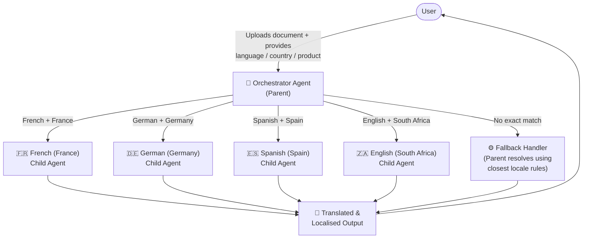
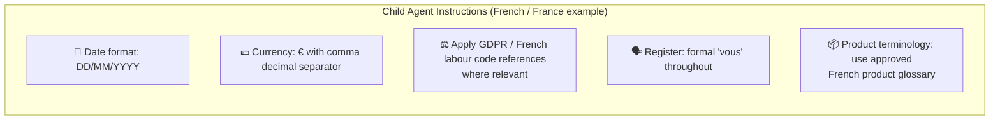
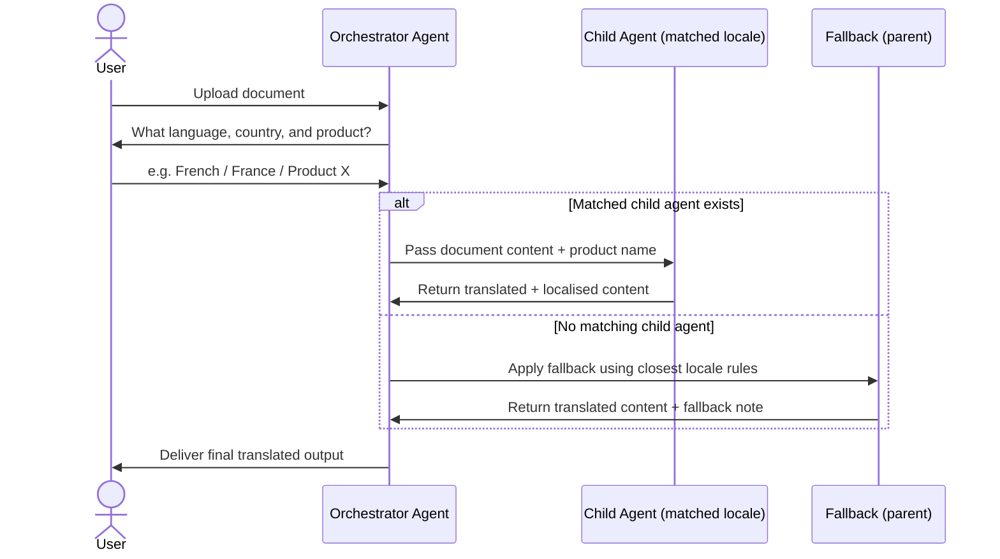

> **Note:** This post covers a personal side-project built in my own time to explore agentic AI workflows. No proprietary data, internal systems, or confidential business logic is described here. All examples use generic or publicly available content.

---

## Why I Started Thinking About This

If you've ever tried to manage multilingual documentation at any scale, you'll know the pain. The options broadly fall into three buckets — and none of them are great.

### The Translation Landscape (and Its Problems)


type: 'bar',
data: {
  labels: ['Human Translators', 'CAT Tools\n(e.g. SDL Trados)', 'Machine Translation\n(DeepL / Google)', 'LLM Prompting\n(DIY)', 'Orchestrated Agent\n(This project)'],
  datasets: [
    {
      label: 'Cost (relative)',
      data: [90, 60, 15, 20, 25],
      backgroundColor: 'rgba(99, 102, 241, 0.7)',
    },
    {
      label: 'Context / Control (relative)',
      data: [85, 65, 30, 55, 85],
      backgroundColor: 'rgba(20, 184, 166, 0.7)',
    },
    {
      label: 'Scalability (relative)',
      data: [20, 45, 90, 70, 88],
      backgroundColor: 'rgba(251, 146, 60, 0.7)',
    }
  ]
},
options: {
  responsive: true,
  plugins: {
    legend: { position: 'top' },
    title: {
      display: true,
      text: 'Translation Approaches: Cost vs Control vs Scale'
    }
  },
  scales: {
    y: {
      beginAtZero: true,
      max: 100,
      title: { display: true, text: 'Score (0–100, higher = better)' }
    }
  }
}


**Human translators** are the gold standard for nuance and accuracy — but they're expensive, slow to scale, and entirely dependent on the translator understanding the product domain. For a niche software product with specific UI terminology, you're also paying to onboard every new translator into your world.

**CAT tools** (Computer-Assisted Translation, like SDL Trados or memoQ) are used by professional translation agencies and in-house teams. They maintain translation memories and glossaries, which is genuinely useful. But the licensing cost is significant, the UX is built for professional translators (not content authors), and you're still largely dependent on human throughput. They also don't reason — they pattern-match.

**Machine translation** (DeepL, Google Translate, Azure Translator) is cheap and fast. For general content, it's often surprisingly good. But the moment you need domain-specific terminology, product names, regional legislation references, or consistent voice — it falls apart. There's also almost no way to give it *context*: it doesn't know your product, your audience, or your regional requirements.

**DIY LLM prompting** — just pasting content into Copilot, ChatGPT, Gemini, or Claude — is what many people are doing now. It's better than raw machine translation because you can front-load context in the prompt. But it doesn't scale, there's no consistency across sessions, and you're manually managing every output.

The gap I kept coming back to: **what if you could encode all that context — product knowledge, regional legislation, terminology — into a system that routes each job to the right specialist automatically, and runs inside your existing tooling?**

That's what this project set out to build.

---

## Enter Copilot Studio — Clunky, But Strategically Smart

Before getting into the build, I need to be honest about the platform, because I have complicated feelings about it.

### The WYSIWYG Reality

Microsoft Copilot Studio is a low-code/no-code agent builder that sits within the Microsoft 365 ecosystem. If you've used Power Automate, Power Apps, or even older tools from Microsoft meant to cater to the low-code crowd, you'll recognise the aesthetic: a canvas-based, click-through interface with branching logic, configuration panels, and a test pane running alongside.

It is, genuinely, a bit clunky.

It feels like the product of several internal Microsoft teams merging their roadmaps — traces of the old Power Virtual Agents interface, Power Automate's flow logic, Azure Bot Service's underlying architecture, and now a fresh layer of generative AI capability on top. You can feel the seams. Navigating between Topics, Actions, Knowledge sources, and Agent configuration is not intuitive the first few times. The test console is useful but limited. Error messages are vague.

There's also a mode of working that I'd describe as *click-first, think-later* — the UI constantly encourages you to add things (topics, triggers, nodes) rather than reason about architecture upfront. Coming from a background where you'd sketch out a system design before creating, this friction is real.

**And yet.** I kept coming back to it.

### Why It's Actually a Smart Bet for Organisations

Here's the thing: the clunkiness is almost a feature for the use case it's actually targeting.

Copilot Studio isn't designed for engineers who want fine-grained control. It's designed for **the broader knowledge workforce** — the ops analyst, the HR business partner, the documentation team lead — who needs to build something useful without spinning up infrastructure, managing APIs, or writing deployment pipelines.

The guardrails that frustrate power users are precisely what makes it safe to roll out across an organisation:

- **It lives in your tenant.** Data governance, access controls, compliance boundaries — all inherited from your existing M365 setup. Nothing leaves without your IT team's approval.
- **Authentication is handled.** No API key management, no OAuth dance. Users authenticate with their Microsoft identity.
- **Deployment is built in.** Publish to Teams, SharePoint, a web widget — a few clicks, not a DevOps sprint.
- **Audit and analytics come for free.** Conversation logs, engagement metrics, satisfaction scores — all surfaced in the platform.

For organisations that are asking *"how do we get our teams actually using AI agents?"* rather than *"how do we build the most capable agent?"*, Copilot Studio is a genuinely defensible answer. The ceiling is lower than a custom-built solution, but the floor is much, much higher in terms of adoption and safety.

The recent addition of **Anthropic's Claude models** (including Claude Opus 4.6) as selectable reasoning engines has meaningfully raised that ceiling. The jump in reasoning quality — particularly for complex, multi-step tasks like this one — is noticeable.

---

## Concepting the Agent

### The Core Problem Statement

I wanted to build something that could:

1. Accept a document in any of several common formats
2. Understand enough context to translate it *intelligently* — not just word-for-word, but adapting for regional legislation, currency formats, date conventions, and product-specific terminology
3. Do this across multiple target locales, each with their own rules
4. Be usable by someone who isn't a translator or an AI engineer

The key insight was that **a single monolithic agent trying to do all of this would be terrible**. The context needed for French (France) localisation is different from English (South Africa). Trying to load all of it into one agent's instructions creates a bloated, confused system that makes inconsistent decisions.

The answer was **orchestration**: a parent agent that understands the routing problem, and specialist child agents that each deeply understand one locale.

### Conceptual Architecture



### Requirements

Before touching the builder, I mapped out what the system needed to do:

**Functional requirements:**
- Accept `.txt`, `.md`, `.csv`, `.docx`, and `.pdf` file uploads
- Collect three pieces of context from the user: target language, target country, and product line
- Route to the correct specialist child agent based on language + country combination
- Each child agent must apply: regional date/number/currency formatting, locale-specific legislation references, product-specific terminology, and appropriate formal register
- Fall back gracefully if no matching child agent exists
- Return output in the same format and structural hierarchy as the input

**Non-functional requirements:**
- Must run entirely within the M365 tenant
- No external API calls to translation services
- Usable by a non-technical user with no prompting experience
- Response quality should be consistent across runs for the same input

---

## Building It: Step by Step

> 📸 *I'll be inserting screenshots and GIFs from the Copilot Studio interface at each step later.*

### Step 1: Create the Parent (Orchestrator) Agent

The first step is creating the top-level agent in Copilot Studio. This agent's job is **only** to receive the document, collect the three context inputs, and route — it does no translation itself.

**Key configuration:**
- Set the agent's model to Claude Opus 4.6 (under *Select your agent's model*)
- Write a clear, scoped system prompt that describes the routing logic and explicitly tells the agent it should not attempt translation directly
- Add the supported file types to the knowledge/upload configuration

*[Insert screenshot: Agent creation screen with model selection and description field]*

The system instructions for the parent follow this structure:

```
You are a translation routing agent. Your job is to:
1. Receive a document from the user
2. Ask the user for: target language, target country, and product line
3. Based on the language + country combination, call the appropriate child agent
4. Pass to the child agent: (a) the full document content, and (b) the product name
5. Return the child agent's output directly to the user without modification

Do not attempt to translate content yourself.
```

This explicit negative instruction ("do not attempt to translate") is important. Without it, capable models like Claude will helpfully try to do the job themselves rather than delegating.

---

### Step 2: Build the Child Agents

Each child agent is a separate agent in Copilot Studio, configured with deep locale-specific knowledge in its system instructions.



The child agents are configured to:
- Receive the document content and product name as their input
- Apply all locale-specific rules in their system instructions
- Return **only** the translated content — no preamble, no commentary, no summary

That last point is critical. The parent agent needs clean output it can pass directly to the user. If child agents add conversational wrap ("Here is your translation! I hope this helps..."), it pollutes the output.

*[Insert screenshot: Child agent configuration panel with instructions visible]*

---

### Step 3: Connect the Child Agents to the Parent

This is where Copilot Studio's **Agent Teams** feature comes in — and where the interface gets its most "WYSIWYG" feel.

In the parent agent's configuration, you add each child agent as a callable action. Copilot Studio handles the invocation protocol; you define:
- When to call which child agent (via conditional branching in the topic logic, or via the model's own routing decision)
- What to pass as input
- How to handle the response

I opted for **model-driven routing** rather than explicit branching logic — meaning I describe the routing rules in the parent's instructions and let Claude decide which child to call, rather than building a decision tree in the topic flow. This is more flexible and handles edge cases (unexpected language/country combinations) more gracefully.

*[Insert screenshot: Agent Teams panel showing child agents connected to parent]*

---

### Step 4: Handle the Fallback

Not every language/country combination has a dedicated child agent. The fallback logic instructs the parent to:

1. Identify the closest matching child agent (e.g. for Portuguese (Brazil), use the Spanish (Spain) agent as a structural reference)
2. Perform the translation itself, guided by the closest locale's rules
3. Note in the output summary that a fallback was used and which reference locale was applied

*[Insert screenshot: Fallback handling in parent instructions]*

---

### Step 5: Test End-to-End

The built-in test console in Copilot Studio is useful for iteration, though limited. A typical test run:

1. Upload a sample document
2. Answer the three context questions
3. Observe which child agent is invoked (visible in the activity log)
4. Review the translated output for accuracy and formatting

*[Insert screenshot: Full end-to-end test in the test console — document upload through to translated output]*

---

## Current State

Here's an honest snapshot of where the project sits today:

### ✅ Working

- **Document ingestion** — accepts `.txt`, `.md`, `.csv`, `.docx`, and `.pdf` uploads reliably
- **Context collection** — the parent agent asks for all three inputs in a single message (not three separate turns), which keeps the flow clean
- **Locale routing** — correctly identifies and invokes the matching child agent for supported language/country combinations
- **Context-aware translation** — output reflects regional formatting, terminology, and legislation references, not just word-for-word substitution. A document written for one market's product edition is genuinely re-contextualised for another
- **Format and structure preservation** — translated output mirrors the heading hierarchy, list structure, and section order of the original
- **Fallback handling** — unmatched locales are handled gracefully with a noted reference locale

### 🔜 Still to Do

- **Text in images** — diagrams, screenshots, and UI mockups containing text are currently passed through untranslated. Extracting and translating embedded text in images (OCR → translate → re-render) is the next meaningful capability gap
- **Localised image reconstruction** — once text in images can be translated, the next step is generating a localised replica of the image with the translated text in place, preserving layout and visual design as closely as possible
- **Full file format export** — the agent currently returns translated content as text in the chat. Exporting directly to the original file format (`.docx`, `.pdf`, `.md`, `.csv`, `.xliff`, `.jpg`, `.png`) would make it production-ready for handoff workflows

---

## Architecture Recap



---

## What This Points To

### The Skills Pattern

If you've looked at how **Claude's Skills** (or similar composable agent frameworks) work, this architecture will feel familiar. The pattern is similar:

- A high-level orchestrator manages intent and context routing
- Specialist sub-agents (or skills) each do one thing deeply and well
- The orchestrator stays lean; the specialists carry the domain knowledge
- Composing and extending the system means adding new specialists, not rewriting the core

The difference here is that this runs inside Microsoft 365 — which means it inherits all the governance, security, and deployment infrastructure that enterprise teams already have in place. The trade-off is flexibility and ceiling; the gain is adoption and trust.

### The Broader Question

The more interesting question this project raised for me: **as Copilot Studio's ceiling rises** (better models, richer agent teaming, more capable Actions), does the gap between a custom-built agentic solution and a platform-native one narrow enough to matter?

For teams where adoption, governance, and IT approval are the real bottlenecks — rather than raw capability — the answer is probably already yes.

---

## Next Steps

Beyond the items in the to-do list above, the more architecturally interesting next steps are:

1. **Adding a quality review agent** — a post-translation agent that scores the output against the source document for completeness and flags potential terminology mismatches before delivery
2. **Glossary management** — allowing users to upload or maintain a product glossary that all child agents reference, keeping terminology consistent across runs
3. **Batch processing** — handling multiple documents in a single job, routing each to the appropriate child agent in parallel
4. **XLIFF support** — `.xliff` is the industry-standard interchange format for translation workflows. Supporting it as both input and output would allow this agent to slot into existing CAT tool pipelines rather than replace them
