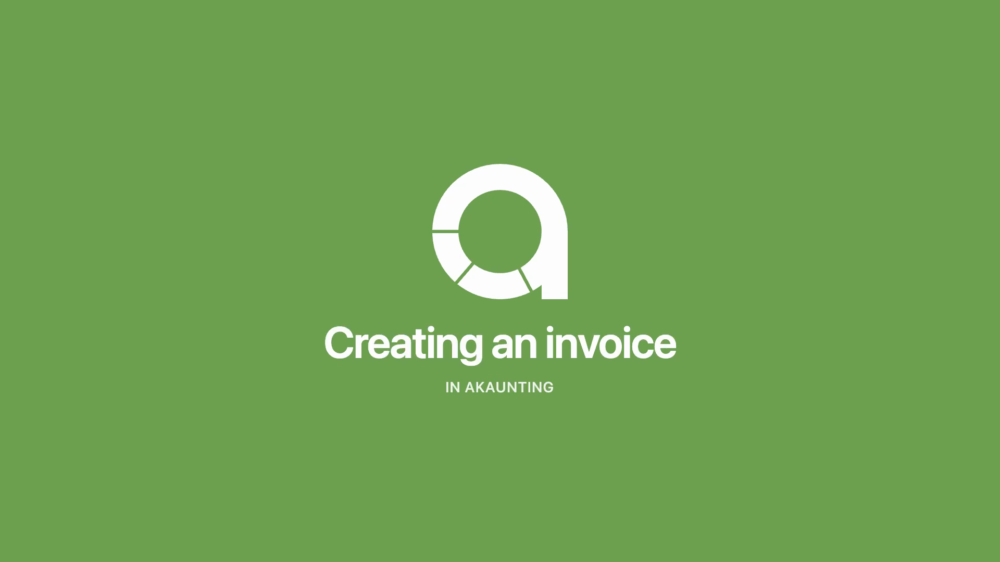
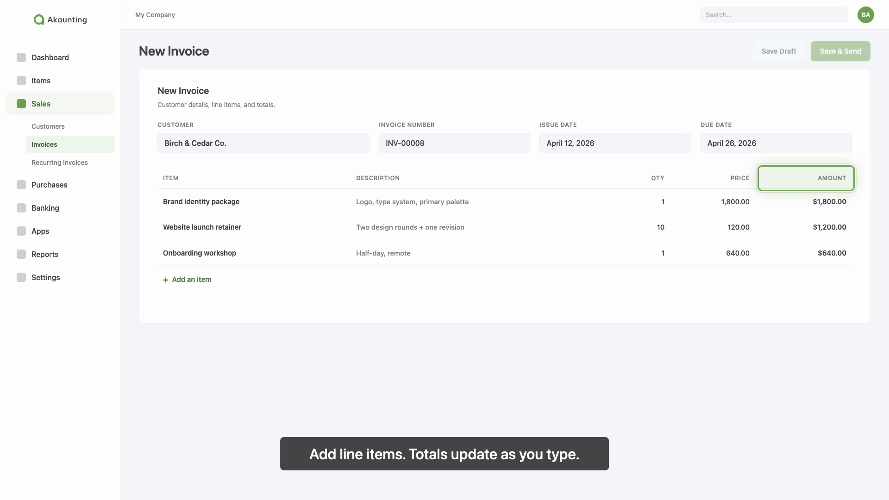
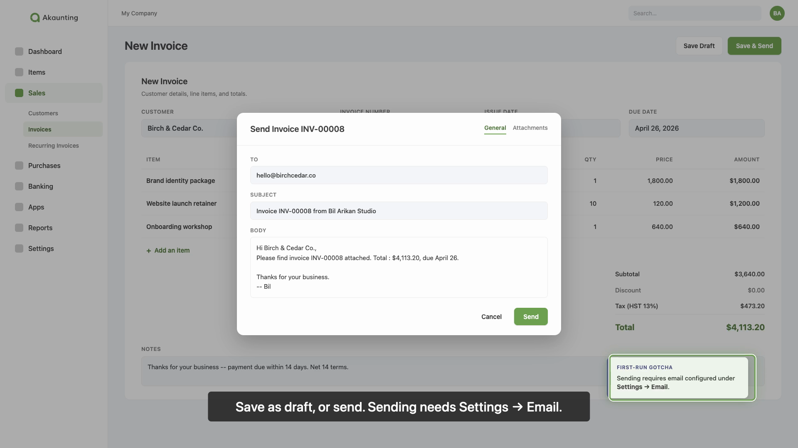

The [first experiment](/posts/video-production-to-dev-workflow-editframe-test-drive/) closed with a question : can an agent take structured product information and turn it into a short, repeatable video composition? This second experiment is the answer.

I pointed Editframe at a real open-source product codebase --- [Akaunting](https://akaunting.com/) --- and asked an agent to produce a how-to walkthrough on creating an invoice, with every product UI scene rebuilt from the codebase rather than screen-recorded. After a review pass we cut trailing dead air and the final video came in at 71 seconds.

The interesting part is not the seconds. It is what this workflow does to the way Learning Program Owners, Learning Designers, and Learning Developers traditionally split the work. In a traditional Learning and Development setup, a video like this passes through three or four hands. In this experiment, most of that flow stayed inside one feedback loop with a coding agent in the seat.

In this post I want to walk through what the agent actually produced, then put the traditional L&D production flow side by side with the code-as-video version, role by role, and call out where the lines between those roles start to blur.

> **Note on branding** : Akaunting is open source ([akaunting.com](https://akaunting.com/), [github.com/akaunting/akaunting](https://github.com/akaunting/akaunting)). Logo, brand colour, and reproduced product screens in this post are used for instructional purposes only --- no partnership, no paid endorsement, no implied affiliation.

## Goal

The goal for this pass was to test whether the code-as-video loop survives contact with a real product. If it does, the cost of producing instructional video for other SaaS product flows drops sharply --- most of the effort would be to provide the context and intent by providing marketing briefs, script outline with screen-mapping, learning objectives, etc. The practical implication for an L&D team : a documented product flow with a few brand assets becomes a candidate for repeatable, scriptable video, not a quote from a video production studio or availability expectation from the learning development team.

## Working assumption

If the agent can read a product's invoice-related views, brand assets, and CSS and translate them into composed scenes that read as that product at a glance, the same loop should hold for any other documented flow inside the same product. The cost of new flows would then be mostly editorial --- script, scene timing, choreography --- not production from scratch.

## Setup

Before scaffolding the experiment, I created a fresh project folder and let Editframe generate a React-flavoured starter --- the previous experiment used the HTML starter, and I wanted to see whether the React side held up against a more realistic composition :

```shell
npm create @editframe@latest
```

I selected the React starter and named the folder `03-codebase-small`. The generated app uses `@editframe/react` (`TimelineRoot`, `Timegroup`, `Text`, `Audio`, `Captions`), the `@editframe/vite-plugin` for local preview, Tailwind CSS, TypeScript, and React 18.

Akaunting's source itself was a separate concern. I added `03-codebase-small/sources/` to the repo's `.gitignore`. The clone is gitignored, so the experiment won't carry Akaunting's source. With that, the project was scaffolded and we were ready to plan.

## How the agent thought through the brief

This is the part I want to slow down on, because it is where most of the actual work happened --- and most of the decisions that would normally pass through three L&D chairs ended up surfacing inside one short conversation with the agent.

I gave the agent a single kick-off prompt :

```text
Use editframe to create a how-to video walking through the creation
of an invoice in Akaunting.
- Use Akaunting's brand for the opening and closing.
- Generate a voice-over that will narrate during the video.
- Read Akaunting's codebase to generate the product UI screens.
- The main page is at https://akaunting.com/
- The "Creating an Invoice" doc is at
  https://akaunting.com/hc/docs/invoices-and-estimates/creating-an-invoice/
- Codebase at https://github.com/akaunting/akaunting
- Forum at https://akaunting.com/forum

Please ask me clarifying questions that will help you in planning.
```

The agent's first move was not code. It triaged the brief into two piles : decisions it could make on its own from the project's working agreements (folder layout, file naming, gitignore patterns, which Editframe imports to use, which scene split was reasonable for a 90-second walkthrough), and decisions where the wrong default would change the shape of the workflow downstream or burn render minutes. The first pile it just handled. The second pile it surfaced as a short, structured set of questions :

````markdown
```markdown
The remaining questions are the ones I'd genuinely make different decisions on depending on your answer :

**Experiment 03 -- Akaunting "Create an Invoice" video planning**

> **How should the product UI screens be produced? This is the biggest decision -- it changes the whole workflow.**
> - Rebuild from code -- I read Akaunting's Blade templates, CSS, and assets, then compose equivalent React/HTML scenes inside the Editframe composition that look like the Akaunting invoice UI. Most aligned with the 'read codebase' goal. No running Akaunting instance needed. ✔
> - Screen recording -- I spin up Akaunting locally (Docker), click through the invoice flow, and drop the recording or screenshots into the Editframe composition with narration on top. Highest visual fidelity but closer to traditional screen recording with Editframe as wrapper.
> - Hybrid -- code-built UI scenes for the walkthrough, plus Akaunting's real logo and brand colors pulled from the codebase for the open/close. Reasonable middle ground.
> - Mockup style -- simplified UI scenes inspired by Akaunting (not byte-accurate). Fastest, but undermines the experiment 03 goal.

> **Where should the Akaunting source code live for reading? Per CLAUDE.md, large reference repos shouldn't be vendored in the repo.**
> - Clone akaunting/akaunting into a new gitignored folder (e.g. 03-codebase-small/sources/akaunting/) and add it to .gitignore. I do the clone. ✔
> - I (Bil) already have a local clone somewhere -- I'll point you at the absolute path so you read it read-only.
> - Don't clone the full repo. Read only specific files on demand from GitHub raw URLs (more surgical, slower if we need to grep across many files).

> **How long should the final video be? Drives how many discrete steps fit and how dense the narration is.**
> - ~30 seconds -- very tight. Title, 3-4 condensed steps, CTA close. Good for social.
> - ~60 seconds -- one minute. Title, 5-6 steps with brief narration each, close.
> - ~90 seconds -- comfortable pacing for a full create-and-send flow. ✔
> - 2-3 minutes -- proper walkthrough. Each step gets room to breathe. More like a learning module.

> **What should generate the voiceover narration?**
> - macOS `say` (free, robotic-ish). Same approach as experiment 01.
> - Cloud TTS (e.g. ElevenLabs / OpenAI). Better quality but needs an API key and a small spend. I'd ask you to set the key in .env.
> - I'll record the narration myself once you give me the script.
> - Check first whether Editframe has native TTS in `@editframe/react` or its skills, and prefer that if it exists. Fall back to macOS `say` if not. ✔

> **Should the narration acknowledge common pain points from the Akaunting forum (e.g. SMTP setup issues when sending invoices), or stay on the happy path?**
> - Happy path only -- keep the walkthrough focused on creating-and-saving an invoice. Forum is background context, not narration content.
> - One short aside near the 'send invoice' step (e.g. 'before sending, make sure email is configured under Settings > Email'). ✔
> - Sprinkle 2-3 forum-sourced tips through the walkthrough where they fit naturally.

Locked. Here's the plan I'd like to run, given those answers. It maps cleanly onto the experiment 03 brief I scaffolded earlier, and explicitly flags every place I'd want you to pause me before I do something costly or commit to a render.
```
````

Worth flagging : this is what a useful clarifying-question pass looks like. Each question names the decision, lays out two to four options, includes the trade-off in plain language, and marks the one the agent would default to (✔). It is closer to a Learning Designer's pre-production checklist than to a developer ticket. I picked the marked default on every line --- the agent's reading of the brief was in alignment with mine --- which meant the entire scoping pass took a few minutes instead of a meeting.

The shape of these questions is also worth noticing. Three of the five (UI rendering, video length, narration source) are decisions a Learning Designer normally drives. One (where to clone the source) is a Learning Developer decision. One (the SMTP forum aside) is the editorial call I flagged earlier as the most editorially-loaded source. The agent did not respect those role boundaries when sequencing its questions. It just asked them in order of how much downstream work each one would change.

With my answers locked, the agent translated them into a plan :

````markdown
## Plan -- experiment 03, "Create an invoice in Akaunting"

> Outcome target : a ~90s 1920x1080 MP4, local CLI render only, all UI scenes rebuilt from the Akaunting codebase, narrated, with static subtitle blocks. Akaunting brand on open and close. One short forum-sourced aside about email setup near the send step.

### Phases

1. **Docs sync** -- write the locked decisions and the storyboard into `docs/03-codebase-small/03-codebase-small.md` and append to both notes files. Pure documentation, no code yet.
2. **Source acquisition** -- add `03-codebase-small/sources/` to `.gitignore`, then `git clone https://github.com/akaunting/akaunting 03-codebase-small/sources/akaunting`. **I'll pause for your go-ahead before cloning** -- the repo is a few hundred MB and the working agreement says no speculative work.
3. **Codebase research** (read-only, no edits to the cloned repo) :
   - Invoice flow views : `resources/views/sales/invoices/*.blade.php`, related `app/Http/Controllers/Common/Invoices.php` (or current equivalent).
   - Visual tokens : `webpack.mix.js`, Tailwind config, brand color CSS, font choices.
   - Brand assets : logo files in `public/img/` or `resources/assets/` -- copy to `03-codebase-small/src/assets/akaunting/`.
   - Forum thread for the SMTP aside : the Gmail-as-sender thread from [akaunting.com/forum](https://akaunting.com/forum) is the cleanest invoice-adjacent issue to acknowledge.
4. **TTS verification** -- read the `editframe-composition` and `editframe-motion-design` skill files to confirm whether Editframe exposes native audio/TTS in `@editframe/react`. If yes, use it. If not, fall back to macOS `say` plus `afconvert` to `.m4a`, same as experiment 01.
5. **Script + storyboard** -- draft 90s narration (~140-160 words), map each sentence to a scene with explicit duration. Save under `docs/03-codebase-small/03-codebase-small-script.md` so you can review the words before any rendering.
6. **Composition build** -- split scenes into per-file React components under `03-codebase-small/src/scenes/` (e.g. `OpeningBrand.tsx`, `InvoiceList.tsx`, `NewInvoiceForm.tsx`, `ItemsSection.tsx`, `TotalsAndDueDate.tsx`, `SendInvoice.tsx`, `ClosingBrand.tsx`), composed in `src/Video.tsx` via `<Timegroup mode="sequence">`. Static subtitle blocks under narration.
7. **Local preview** -- `cd 03-codebase-small && npm start`. Iterate on layout, timing, fidelity. You review.
8. **Render** -- **confirm with you before triggering**. Local CLI only :  `node node_modules/@editframe/cli/dist/index.js render . --output "akaunting-create-invoice.mp4" --include-audio` from inside `03-codebase-small/`. Run outside the agent sandbox if needed (experiment 01 lesson).
9. **Document** -- fill in the outcome section of the brief + append final entries to AI and human notes. Then we decide whether experiment 04 still adds anything beyond this, or whether 03 collapses experiment 04 into itself.

### Draft narration outline (90s)

| Time | Scene | Narration |
|---|---|---|
| 0-5s | Akaunting logo, brand background, title "Creating an invoice" | (no narration -- breathing room) |
| 5-15s | Dashboard → Sales → Invoices (left nav highlight) | "From the Akaunting dashboard, open Sales, then Invoices." |
| 15-30s | New Invoice form, customer dropdown | "Select New Invoice. Pick the customer, or add a new one inline." |
| 30-50s | Items section, quantities, tax | "Add each item with its quantity, price, and tax. Akaunting totals it as you type." |
| 50-65s | Totals + due date + notes | "Set the due date. Add notes or a discount if you need them." |
| 65-80s | Save / Send dialog, SMTP aside | "Save as draft, or send it. Heads up : sending requires email configured under Settings → Email -- a common first-run gotcha." |
| 80-90s | Confirmation, invoice in list, Akaunting outro | "And it's logged. Recurring? Schedule it once. Done." |

### Storyboard scenes (UI rebuilds, code-as-video)

1. Akaunting brand open.
2. Sales → Invoices list (left nav, header, empty or seeded list).
3. New Invoice form, top half (customer, dates).
4. New Invoice form, items table.
5. Totals + due date + notes.
6. Save/Send dialog, with subtle aside for SMTP setup.
7. Confirmation row in invoice list.
8. Akaunting brand close.

### Risks I'm carrying in already

1. **Editframe React variant is new for this repo** -- experiment 01 used the HTML starter. Component primitives may behave subtly differently; I'll surface anything weird in notes.
2. **Akaunting's real UI is Vue + Bootstrap-flavored Tailwind** -- I'm rebuilding it as React/JSX inside Editframe. Goal is visual parity, not functional. Form fields don't have to be interactive; they just have to look right at a given moment in the timeline.
3. **`ef-captions` is on the avoid list** -- using static subtitle blocks per experiment 01.
4. **Cloning Akaunting** is a one-time action with disk cost. Gitignored. Easy to remove.
5. **Brand usage** is a fair-use call. Akaunting is open source, so logo + color usage in an instructional video aimed at their own users should be fine, but I'll keep a "no implied endorsement" beat if you want one.

### Want me to start?

If this plan looks right, I'll begin with Phase 1 (docs sync) right away, since it doesn't touch any code or external systems. I'll **pause before Phase 2** (the clone) and ping you for the green light.

If you want to change anything -- different scene split, different narration shape, drop the SMTP aside, longer/shorter total duration, different brand-handling stance -- now is the cheap moment to say so.

````

Two things in that plan are worth pulling apart from the artifact, because they are easy to miss reading it as one block :

1. **The plan was not me dictating phases.** It was the agent translating "make a how-to video about Akaunting" into a sequenced workflow that respected the constraints from the project's `CLAUDE.md` --- don't render without confirming, don't vendor large repos, don't write speculative code, leave secrets alone. The phase split, the storyboard skeleton, the scene-component naming, even the draft narration timing table --- all of it was the agent reading the project's working agreements and the source URLs together, then producing the structure that fit them.
2. **The pause points were the most useful structural decision.** Cloning a third-party repo (Phase 2), generating audio (within Phase 5), and triggering a render (Phase 8) are each places where I want to look at the plan one more time before disk space or render time gets spent. The agent treated each as a checkpoint, not a step it could blow through. Worth flagging for any team standing this up : a coding agent that builds video without consent gates is a coding agent that will produce video you did not ask for, at a scale you did not prepare for.

Net effect : this single pre-build conversation absorbed roughly the work of a Learning Program Owner brief, a Learning Designer storyboard kickoff, and a Learning Developer scoping note. None of those were skipped --- the questions and the plan are exactly the artifacts those three roles would normally produce in three different chairs. They just compressed into one short structured exchange in a single agent loop.

## Building the composition

Phase 3 (codebase research) was where the agent inspected the cloned Akaunting tree and pulled out the structural pieces : invoice views are intentionally thin Blade shells that delegate to shared components under `resources/views/components/documents/`. The actual invoice form structure --- metadata block (customer / dates / number), items table with fixed columns, totals panel, free-text notes section, send-invoice modal at `resources/views/modals/invoices/email.blade.php` --- never needed inventing. The agent rebuilt it from the same primitives the real product uses.

Brand details were quick. Akaunting keeps its colour palette in `presets.js` --- primary green `#6ea152`, supporting purple `#55588b`, black `#424242`, blue `#006ea6`, lilac background `#F8F9FE`. Default font is `Quicksand` with `system-ui` fallback. Material Icons for the icon system. The agent pulled all of this directly into a `constants.ts` and a shared `AkauntingShell` component, so every scene reads as Akaunting at a glance without anyone thinking about pixel parity.

What got built :

1. **`AkauntingShell`** --- left sidebar with logo and primary nav, top bar with the company switcher and search, lilac content surface. Configurable via `activeNav` and `activeSalesSub` props so each scene can highlight a different nav item without duplicating chrome.
2. **`InvoiceFormBody`** --- a stage-driven form. Accepts a `stage` prop (`blank` / `metadata` / `items` / `totals` / `send`) that controls how much of the form is filled in. Scenes 3 through 5 each tell the form which layer they're introducing ; the form handles the staggered fade-in of values internally.
3. **`Highlight`** --- a green pulse ring drawn around any element tagged with `data-target="some-key"`. Position is read from the DOM at mount, so when the layout moves, the ring follows. Two variants : a 1.6s "look here" pulse and a 0.7s click-style tap.
4. **`Subtitle`** --- a static bottom-of-frame caption block with a subtle rise-in animation. Static rather than timed, because of the `ef-captions` failure mode from experiment 01.
5. Eight scene components --- `OpeningBrand`, `InvoiceList`, `NewInvoiceForm`, `ItemsSection`, `TotalsAndDueDate`, `SendInvoice`, `Confirmation`, `ClosingBrand` --- composed in `Video.tsx` via `<Timegroup mode="sequence">`.

Audio came next. macOS `say`, slowed to ~170 wpm, converted to `.m4a` via `afconvert`. The first attempt used a single script with silence directives between scenes for the silent gaps. Result : 73.7 seconds for a 90-second target. macOS `say` compresses long pauses by ~25%. Sanity-check pass : speech-only generation of the same words came in at 37.1 seconds, which means `say` had inserted ~36.6 seconds of the requested 48.6 seconds of silence. The fix was to switch from inline silence directives to deterministic post-processing. `scripts/build-narration.py` now renders each scene's narration to its own audio fragment, pads each one with exact silence to fit its scene window, and concatenates. Re-running the script regenerates the audio deterministically, frame-accurate to the composition.

Animation polish was done in iteration. The first mouse cursor animation pass used pixel-coordinate waypoints. The cursor consistently landed 20-30 px above-and-left of intended targets in the workbench, with no clean way to back-derive the offset. I asked for a swap to highlights instead. The agent built `Highlight` with a `data-target` lookup, replaced every per-scene cursor track with a `<Highlight>` sequence, and kept `CursorTrack.tsx` in the tree as reference for any future scene that genuinely needs per-pixel cursor motion. Net effect : the ring landed on or almost on its target, it was good enough for this experiment.

Pacing rebalanced last. The first cut was 90 seconds with audible trailing silence in scenes 3 to 5. I asked for two changes folded together : trim the dead air, and split scene 3's narration so "Click New Invoice" lands at exactly 11 seconds. The agent extended `build-narration.py` with a `Beat` dataclass --- a single scene can now render N speech segments separated by exact silence --- regenerated the audio, retimed every highlight, and re-rendered. Total runtime dropped from 90s to 71s. One editorial call, every downstream change handled by the agent.

## Rendering

Same CLI command shape as first experiment, run from inside `03-codebase-small/`, outside the agent sandbox so Chrome / Playwright can launch :

```shell
node node_modules/@editframe/cli/dist/index.js render . \
  --output "akaunting-create-invoice.mp4" \
  --include-audio
```

The first render completed cleanly in 19 seconds : 2,130 frames at 30 fps, 3.71x real-time, 1920×1080, stereo AAC, 3.5 MB. No `ef-captions` failures, because the composition uses the static `Subtitle` block from the start --- the workaround from the first experiment is now the default.

Then I noticed the rendered MP4 was missing most of the green highlight rings I could see in the browser preview. Same composition, same code, different output.

The `Highlight` component used `useEffect` to measure each target's position via `offsetParent` --- a passive effect that fires after paint. By the time it ran, Editframe's visibility pass had already hidden every inactive scene with `display: none`, and `offsetParent` returns `null` for any element with a hidden ancestor. The measurement bailed silently for every scene except the active one, no rings ever rendered. Switching to `getBoundingClientRect` did not help either, until it was wrapped in a `requestAnimationFrame` retry loop that bails the moment the scene reports a non-zero size.

After the fix, the source DOM has all 32 highlight rings present, every render clone inherits them, and the rendered MP4 matches the preview. Re-rendered in 26 seconds, 2.7x real-time. New MP4 is 3.6 MB.

The rendered output : [akaunting-create-invoice.mp4 on GitHub](https://github.com/bilarikan/bilarikan.github.io/blob/main/content/posts/code-as-video-with-editframe/akaunting-create-invoice.mp4).

71 seconds, 1920×1080, every product-UI scene rebuilt from Akaunting's React-equivalent of its own Blade templates. Brand-green opening and closing wraps. Generated voice-over via macOS `say`.

A few rendered frames for a quick preview : 







## What I learned

The good parts :

1. The agent built a coherent 9-phase plan from a single prompt and four URLs --- not because I told it to, but because reading the project's working agreements and the source URLs together implied a sequenced workflow.
2. Visual fidelity from a codebase rebuild is high enough. The Akaunting screens read as Akaunting at a glance, even though the underlying Vue + Bootstrap-flavoured Tailwind UI was rebuilt as plain React with the same brand.
3. The shared primitives --- `AkauntingShell`, `InvoiceFormBody`, `Highlight`, `Subtitle` --- carried their weight. Each scene was small because the chrome was somewhere else.
4. Narration generation is an automated step, not a hand-generated asset. `scripts/build-narration.py` makes the audio reproducible and exact-length.
5. The forum was the most editorially-loaded source. The SMTP aside is the line in the video that makes it useful to a real first-time Akaunting user, and it came from a non-code source the agent surfaced on its own.

The rough edges were also useful :

1. CSS animations that depend on DOM measurement need `useLayoutEffect` plus a `requestAnimationFrame` retry, not `useEffect`. Otherwise the preview will look correct and the render will silently drop them.
2. Pixel-coordinate-driven cursor animation is brittle in Editframe's render pipeline.
3. Rebuild-from-code is bounded by what is worth rebuilding in 90 seconds. Pixel-perfect parity is the wrong goal. A lower fidelity "Reads as the product at a glance" is the right one.

That last point connects to the next part of the post. The render worked, the loop survived contact with a real product codebase, and the experiment closed with a working artifact. The interesting question now is what this loop did to the way an L&D team would normally split this work between Program Owner, Designer, and Developer chairs. The remainder of the post is the practitioner read on that.

## The four elements the agent assembled

In a traditional L&D production, this video would be built as a sequence of role handoffs. The Learning Program Owner reads the product marketing brief and feature documentation, interprets it as learning objectives and audience-shaped outcomes, and commissions the work. The Learning Designer turns those objectives into a script and a storyboard. The Learning Developer captures the screen recordings, sources or generates the audio narration, and composes everything in a timeline editor. Each handoff carries a review gate, and a small change late in the chain (say, a wording tweak after the screen recording is already cut, or a UI version bump on the product side) can ripple all the way back upstream.


flowchart TD
  brief["Product marketing brief<br/>+ feature documentation"]
  brief --> lpo["Learning Program Owner<br/>reads brief,<br/>interprets as<br/>objectives and outcomes"]
  lpo --> ld["Learning Designer<br/>writes script,<br/>storyboards scenes,<br/>plans visuals"]
  ld --> screen["Learning Developer<br/>captures screen recordings<br/>of the live product"]
  screen --> audio["Learning Developer<br/>or voice talent<br/>records audio narration"]
  audio --> compose["Learning Developer<br/>composes and edits<br/>in a timeline editor"]
  compose --> output["MP4 deliverable"]


That serialized chain is what produces the four streams that show up in the final composition --- the product UI screens, the voice-over track, the captions, and the brand wrapper. In a traditional setup, those four streams live in different tools, on different desks, and converge late in editing. In this experiment, all four streams ran through the same coding agent, against a single source tree :

1. **Product UI screens** were rebuilt as React components from Akaunting's Blade templates and shared component library (`resources/views/sales/invoices/` and `resources/views/components/documents/`). No screen recording, no commissioned mockup. The agent inferred form structure --- metadata block, items table, totals panel, notes section, send modal --- from the actual code.
2. **Brand wrapper** was sourced from the product's own code. Brand tokens, three logo SVGs, font, colours, icons. The opening and closing cards use the brand mark on brand green ; the sidebar uses the horizontal lockup. The agent never had to design anything --- it inherited the identity.
3. **Voice-over track** was generated then post-processed by a Python build script that pads each segment with exact silence and concatenates to `.m4a`. Reproducible, frame-accurate, and rebuildable from the script file alone. 
4. **Captions** were rendered as a static `Subtitle` component under each scene rather than as a timed caption track. 


flowchart TB
    ui["Product UI screens<br>traditional : screen recording<br>by Learning Developer"] --> agent["Coding agent<br>reads sources,<br>forms plan"]
    voice["Voice-over track<br>traditional : booked talent<br>plus sound editor"] --> agent
    caption["Captions / subtitles<br>traditional : post-production<br>by Learning Developer"] --> agent
    brand["Brand wrapper<br>traditional : design ops<br>or marketing brand kit"] --> agent
    agent --> compose["Composes and renders"]
    compose --> output["71s composition<br>1920x1080 MP4"]


The point worth flagging : in a traditional setup, those four streams converge late, in editing, after a chain of role handoffs that each carry their own review gate. In this setup, they converge early, in code, inside a single agent loop with the practitioner reviewing at the seams. That changes which roles are spending time on what --- and which handoffs disappear entirely.

## The four sources the agent read

Before any of those four elements got assembled, the agent had to read four different sources of information about the intended video and merge them into a single plan :


flowchart TD
  codebase["Akaunting codebase<br/>resources/views/sales/invoices/<br/>presets.js<br/>public/img/"]
  docs["Akaunting docs<br/>'Creating an Invoice'<br/>help-center page"]
  forum["Akaunting forum<br/>SMTP / email setup<br/>recurring question"]
  brand["Brand assets<br/>logo SVGs<br/>palette, fonts"]
  agent["Coding agent<br/>9-phase plan<br/>scene components<br/>narration script"]
  composition["Editframe composition<br/>71s, 1920x1080"]

  codebase --> agent
  docs --> agent
  forum --> agent
  brand --> agent
  agent --> composition


Each source contributed something different. The codebase contributed structure --- the actual shape of the invoice form, the items table columns, the email modal. The docs contributed the narrative spine --- the help-center "Creating an Invoice" page that lays out the steps in plain English. The brand assets contributed the wrapper, no design needed. And the forum contributed the cautionary aside : a recurring thread about why "Send" looks like it works but emails never go out, because SMTP is configured separately under Settings → Email. That observation is not in the help-center article. It is the question first-time users hit. The agent surfaced it as a four-second narration aside in the send scene.

That last one is the most editorially-loaded source, and the most useful signal for L&D. A traditional Learning Designer would ask "what do learners actually trip on?" and look at support tickets, forum posts, or interview notes. The agent did the same thing, against a forum, and dropped the result into the script in the right beat. That is a time-consuming task, executed by an agent.

## How the traditional L&D flow compares to code-as-video

Here is what shifted role by role.

| L&D role                   | Traditional flow                                                                                                                                                                                      | Code-as-video flow                                                                                                                                                                                | What stays human                                                                                                                        |
| -------------------------- | ----------------------------------------------------------------------------------------------------------------------------------------------------------------------------------------------------- | ------------------------------------------------------------------------------------------------------------------------------------------------------------------------------------------------- | --------------------------------------------------------------------------------------------------------------------------------------- |
| **Learning Program Owner** | Read product marketing brief and feature documentation, interpret as learning objectives and outcomes, choose flow, define audience, set business case, secure brand sign-off, commission production. | Same as before --- the agent does not pick what to teach, and does not translate a marketing brief into learning outcomes.                                                                        | Reading the brief, framing the learning outcome, choosing the flow, defining the audience, brand-stance call.                           |
| **Learning Designer**      | Storyboard, write script, plan visuals, choose what gets emphasised, identify common stumbling blocks, time the narration.                                                                            | Drafts a prompt and a few open questions ; reviews and edits the agent's draft script and storyboard ; signs off on editorial calls (which beat to highlight, where to add the SMTP-style aside). | The editorial spine : what gets said, what order, what gets emphasised, where to slow down, where to add a non-obvious aside.           |
| **Learning Developer**     | Record screens, build animations, source voice-over, edit audio, time captions, render and review, hand back for revision.                                                                            | Owns the agent loop, the composition repo, the build scripts, and the render command. Reviews preview, catches render-vs-preview drift, tunes timing.                                             | Validating the rendered output matches the storyboard ; catching the render-only failures ; maintaining the reusable component library. |

The headline : the Program Owner's job barely shifts, the Designer's job concentrates around the editorial calls, and the Developer's job changes shape entirely --- away from screen capture and audio editing, toward composition, components, and build scripts.

### Learning Program Owner --- mostly unchanged, more leverage per decision

In this experiment, picking "Creating an invoice" out of the universe of Akaunting flows was an editorial call. Different flows tell different stories, target different audiences, and carry different business cases. That decision did not move into the agent. It stayed with me, the practitioner running the test-drive --- which is the Program Owner role for this little stack.

What changes is the leverage on each decision. A Program Owner who used to commission one video at a time now commissions a class of videos --- "all customer-enablement walkthroughs of documented Akaunting flows" --- and the production cost per video drops sharply once the component library exist and are accessible. The decisions a Program Owner spends time on shift up the abstraction level : what flows to cover, in what order, for which audiences, in which languages. That is more strategic work, than weighing which video gets to be made first.

### Learning Designer --- the editorial calls concentrate

The agent drafted the narration script, the storyboard, the per-scene timing, the on-screen highlights, and the cursor-versus-ring choreography. I edited each one. The script came back at 90 seconds with audible trailing silence in scenes 3 to 5 ; the review feedback was "shorten and split scene 3 so 'Click New Invoice' lands at exactly 11s." That re-pacing dropped the final runtime to 71 seconds. The agent did the math, regenerated the audio, retimed every highlight, and re-rendered. I made one editorial call ; the agent did all the production downstream of it.

This is the part L&D readers should pay close attention to. The work that survives in the Learning Designer chair is the work that benefits from taste : where to add the SMTP aside, whether to pulse or tap a highlight, whether scene 5 needs to mention "discount" at all. The work that leaves the chair is the work that used to be necessary just to get the words and pictures aligned --- timing math, asset ingest, scene composition, render review.

If a Designer is hired today on the strength of timeline-editing chops, that hire profile is going to look different in two years. The strength that lasts is the editorial spine : knowing what to say, what order to say it in, what to leave out, where the learner will trip, and what the script will not say so the audience can fill that in themselves.

### Learning Developer --- the work changes shape

The Developer chair is where the biggest shift lands. In a traditional flow, this role spends time on screen recording (capture, crop, mask), on audio editing (record, denoise, level, time), and on caption timing. None of that happened here. The product UI was rebuilt from a template. The voice-over was an invocation followed by a deterministic Python build script. The captions were a static React component sitting under each scene.

What replaced those tasks :

1. **Owning the composition repo.** The video lives in code, in a real working directory, with `package.json`, `npm start`, a Vite preview, and a CLI render. That is the Developer's working surface now.
2. **Maintaining the reusable primitives.** `AkauntingShell`, `InvoiceFormBody`, `Highlight`, `Subtitle` --- the four shared components that carried across all eight scenes. The next video starts with these already in place. That is a Developer's component library.
3. **Owning the build scripts.** The narration is a build artifact, not a hand-edited file. If the script changes, the audio regenerates exactly to length. If a build script breaks, the Developer fixes it.

The role still exists. It just looks more like a DevOps engineer maintaining an in-house tool than like a video editor running Premiere. That has implications for hiring and skill paths.

## Where the role lines start to blur

This is the thread I think L&D leaders should care about most, because the traditional org chart is built around the assumption that production work and editorial work live in different chairs. Once the agent owns the heavy production lifting, the boundary between Learning Designer and Learning Developer gets fuzzy in both directions :

1. **A Designer who can write a clear prompt is now also doing some Developer work.** Drafting the kick-off prompt that produced the 9-phase plan, deciding which SMTP-style asides to include, calling for "shorten scene 2 and split scene 3" --- these are Designer instincts, expressed in a developer-shaped tool. A Designer who is comfortable in this loop produces work that used to need a Developer pass to land.
2. **A Developer who maintains the component library is now also doing some Designer work.** Naming primitives, choosing the default timings, deciding whether the highlight rings should "lead" or "follow" the spoken cue --- these are taste decisions baked into engineering work. A Developer who is comfortable making those calls produces a component vocabulary.
3. **The agent itself sits between the two roles.** It does Designer-shaped tasks (drafting the script, surfacing the SMTP aside) and Developer-shaped tasks (composing scenes, generating audio, rendering MP4) in the same loop. Neither role fully owns the agent's work, and neither role is fully replaced by it.

The most valuable hire in two years is going to look more like a "writer-engineer" than either a pure Designer or a pure Developer --- someone who can sit in this loop and own a video end-to-end, with the agent doing the production weight. The traditional title that comes closest is "Learning Technologist" --- a hybrid role that has always sat between instructional design and engineering. That role gets bigger in this future, not smaller. It also gets harder to hire for, because the skill stack is wider.

## What stayed manual, and why

For honest contrast, here is what did not move into the agent in this experiment, and what I think should not :

1. **The flow choice.** Picking "Creating an invoice" out of the universe of Akaunting flows is a Program Owner call.
2. **The narration's editorial spine.** The agent drafted the script ; I reviewed and edited it. The SMTP aside is the line in the video that makes it useful to a real first-time user. A fully-automated system would smooth that line into nothing.
3. **Per-scene timing.** Cutting trailing dead air across scenes 2-6 and locking "Click New Invoice" to land at 11s was an editorial call. The agent did the math after the call, not before.
4. **Highlight choreography.** The agent's first pass was reasonable. Deciding whether a highlight should pulse or tap, whether to lead or follow the spoken cue, whether scene 5's discount mention deserves a ring at all, is a taste decision that responded to a person watching the preview.

The pattern : automate the build steps, and the source-to-scene mapping. Keep the editorial calls (flow, script, timing, choreography) human. That is where the boundary fell for this experiment, and it may fall in the same place for future product flow.

## System design vs manual flexibility, in L&D terms

Every video team is making this trade-off whether they name it or not. There are two extremes, and the right answer for any given video sits between them :

1. **Maximum automation.** A composition that takes structured product input --- release notes, spec, screenshots, brand kit, voice script --- and produces the video with no manual intervention. Twelve locales of the same release video cost twelve renders, not twelve edit sessions. Brand-safe by construction. The cost is upfront design : you have to figure out the right primitives before you can parameterise anything, and a moment of weird, hand-tuned, off-template motion is exactly what a constrained system removes.
2. **Maximum manual flexibility.** Every video is bespoke, hand-built, hand-tuned. Editorial freedom on every beat. Linear effort per video. Visual treatment drifts silently across videos, brand parity becomes a review gate not an automatic property, and a v1.1 patch a month later means re-opening the project file from cold not a quick re-run.

Most release walkthroughs, in-product feature tours, and customer-enablement modules belong on the automated side. Key launches, customer stories, founder messages, exec keynotes typically stay on the manual side.

> Outcome : the loop survived contact with a real product codebase. Source-driven generation works when you give the agent the right sources, and the right sources are not just code. The role implications are real --- the Learning Developer's chair changes shape the most, the Learning Designer's chair concentrates around the editorial calls, and the Program Owner's chair gains leverage per decision. The hardest part for L&D leaders is not the tooling. It is updating the role definitions and expectations.
