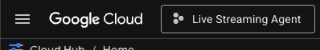
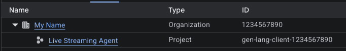

I want to build a live AI assistant that can hear a user and see their screen at the same time --- then talk back to them in real time. Before I get to the screen-sharing part, I need to start with the foundation: getting Google's Agent Development Kit (ADK) bidirectional streaming demo running locally with both microphone and camera.

In this post I walk through the setup step by step, get the full multimodal streaming loop working (voice in, camera in, voice out), and highlight the things that tripped me up. This is the standard bidi demo --- the one Google provides in their [Agent Development Kit (ADK) docs](https://google.github.io/adk-docs/streaming/) and [bidi-demo sample](https://github.com/google/adk-samples/tree/main/python/agents/bidi-demo). Later, I will swap the camera for a screen capture and formulate instructions to turn this into a product guidance agent.

## What ADK Bidirectional Streaming Is

Google's ADK provides a framework for building AI agents. The "bidirectional streaming" (bidi) mode is the part that makes real-time multimodal conversation possible. Instead of the typical request-response cycle where you send text and wait for a reply, bidi streaming opens a persistent WebSocket connection. Audio and video flow in from the user, and audio flows back from the agent, all simultaneously with sub-second latency.

Under the hood, the ADK connects to Google's Multimodal Live API on Vertex AI or Google's AI Studio. The model I'll be using is [gemini-live-2.5-flash-native-audio](https://docs.cloud.google.com/vertex-ai/generative-ai/docs/models/gemini/2-5-flash-live-api), which processes audio and video natively through a single neural network --- no separate speech-to-text, vision-to-text, or text-to-speech pipelines. The audio and camera frames go in, the model reasons over both modalities together, and audio comes back out. This is what makes the latency feel conversational rather than the stop-and-wait robotic feeling of chained pipeline responses.


graph TD
    subgraph UserSide["👤 User Side"]
        A[User Microphone]
        B[User Camera]
        F[User Speaker]
    end

    subgraph ADK["⚙️ ADK"]
        C[ADK Web Server]
    end

    subgraph GoogleCloud["☁️ Google Cloud / Vertex AI"]
        D[Vertex AI Multimodal Live API]
        E[Model Reasoning]
    end

    A -->|Audio| C
    B -->|Video Frames| C
    C -->|WebSocket| D
    D -->|Gemini Model| E
    E -->|Audio Response| D
    D -->|WebSocket| C
    C -->|PCM Playback| F

    A ~~~ B ~~~ F


## Prerequisites

Before we start, you will need:

- Python 3.11 or higher
- A Google Cloud account with an active project
- The Vertex AI API enabled on that project
- The `gcloud` CLI installed and authenticated
- A working microphone, speaker (or headphones), and webcam

## Step 0: Initialize Git Repository

Create a new empty repository on your Git hosting service (GitHub, GitLab, Bitbucket, or a self-hosted server). When creating it, **do not** initialize it with a `README.md`, `.gitignore`, or license file --- this ensures the remote stays empty and avoids merge conflicts on first push.

Next, create a new folder on your workstation to house the project, then open a terminal and navigate into it:

```bash
mkdir live-streaming-agent-with-google-adk
cd live-streaming-agent-with-google-adk
```

Initialize the local Git repository and point it to your remote:

```bash
git init
git remote add origin <your-repository-url>
```

For example, if I'm using GitHub and created a new repository named `live-streaming-agent-with-google-adk`:

```bash
git remote add origin https://github.com/bilarikan/live-streaming-agent-with-google-adk.git
```

You can verify the remote was added correctly by running:

```bash
git remote -v
```

> **Note:** Replace `your-username` and the repository name with your own. The steps above apply to any Git hosting service — only the URL format will differ.

Optional for macOS users, create a `.gitignore` file in the project root to keep unnecessary system files from cluttering the repository:

```gitignore
# macOS
.DS_Store
.AppleDouble
.LSOverride
```

## Step 1: Set Up the Environment

Create a virtual environment, activate it, and install the ADK to the folder. I keep the venv at the project root so it is easy to activate from any subfolder. Remember to activate the Python virtual environment in each terminal you use for this project.

> **Reference:** [Build a streaming agent with Python](https://google.github.io/adk-docs/get-started/streaming/quickstart-streaming/)

```bash
python3 -m venv .venv
source .venv/bin/activate
pip install google-adk
```

> **Note:** A Python virtual environment needs to be activated in each terminal session because activation only modifies the environment variables of the current shell session (primarily `PATH` and `VIRTUAL_ENV`).
>
> When you activate a venv, it temporarily redirects commands like `python` and `pip` to the isolated versions inside `.venv/bin/`.
>
> When that terminal closes, or in any new terminal you open, the shell starts fresh with the system's default environment --- it has no memory of the previous activation.

Now create a folder structure for the agent. ADK expects a specific layout --- an `app/` directory containing your agent as a Python package.

```
live-agent/           # Project folder
└── app/              # The web app folder
    ├── .env
    └── helper_agent/ # Agent folder
        ├── __init__.py
        └── agent.py
```

You can create these exact folders with empty files by running these terminal commands from the project root:

```bash
mkdir -p live-agent/app/helper_agent
touch live-agent/app/.env live-agent/app/helper_agent/__init__.py live-agent/app/helper_agent/agent.py
```

## Step 2: Create the Agent

The agent definition is straightforward. For now I am keeping it simple by copy-pasting the code blocks from [Build a streaming agent with Python](https://google.github.io/adk-docs/get-started/streaming/quickstart-streaming/) --- with a few adjustments, basic instructions, and the `google_search` tool for grounding.

In `agent.py`:

```python
from google.adk.agents import Agent
from google.adk.tools import google_search  # Import the search tool

root_agent = Agent(
    name="helper_agent",
    model="gemini-live-2.5-flash-native-audio",
    description="Agent to help users with questions.",
    instruction="You are a helpful assistant that answers questions. You can see the user through their camera and hear them through their microphone. You stick to the facts and use Google Search when needed to find accurate information.",
    tools=[google_search]
)
```

In `__init__.py`:

```python
from . import agent
```

A couple of things to note here. The model ID (`gemini-live-2.5-flash-native-audio`) is specific to the Live API --- you cannot use a standard Gemini model string. Check the [Vertex AI Live API docs](https://docs.cloud.google.com/vertex-ai/generative-ai/docs/live-api) for the latest available model IDs, because the identifiers change as new models arrive and legacy models are retired.

The instruction is deliberately minimal at this stage. I will expand it significantly in a later post when I swap the camera for screen capture. For now, I want to confirm the full multimodal loop --- mic, camera, and voice response --- works end to end.

## Step 3: Set Up Google Cloud

This is the part that has the most steps, but each one is a one-time setup.

1. **Create or select a Google Cloud project.** If you already have one, use it. If not, create one in the [Cloud Console](https://console.cloud.google.com/).
2. **Enable the Vertex AI API.** Go to [this link](https://console.cloud.google.com/flows/enableapi?apiid=aiplatform.googleapis.com) and enable it for your project.
3. **Install the gcloud CLI** if you have not already. Follow [Google's instructions](https://cloud.google.com/sdk/docs/install) for your OS.
4. **Authenticate.** Run these two commands:

```bash
gcloud auth login
gcloud auth application-default login
```

> **Note:** If `gcloud` is not on your PATH (can happen on macOS if you used the installer and missed a post-install step), use the full path: `~/google-cloud-sdk/bin/gcloud`. You should fix the PATH issue in the long term, but the full path will get you going now.

Your default browser will open to a Google Cloud permissions page. Read through and accept to allow gcloud to access the services needed on your Google Cloud account.

5. **Configure the `.env` file** inside `live-agent/app/`:

```env
GOOGLE_GENAI_USE_VERTEXAI=TRUE
GOOGLE_CLOUD_PROJECT=your-project-id-here
GOOGLE_CLOUD_LOCATION=us-central1
```

I will be using Google Cloud / Vertex AI and setting it to `TRUE`. If you are using Google AI Studio instead, set it to `FALSE`. I am using `us-central1` for the location, but you can use any region that supports the Live API. For production use, consult the [Deployments and Endpoints page](https://docs.cloud.google.com/vertex-ai/generative-ai/docs/learn/locations) to check which regions the model is deployed in.

Replace `your-project-id-here` with your actual project ID. To find the project ID in Google Cloud:

1. Log in to your [Google Cloud Console](https://console.cloud.google.com/).
2. Click the project picker button at the top left, next to the Google Cloud branding.
 
3. Copy the **ID** for the project you created with Vertex AI enabled. (Note: the project ID is not the same as the project name.)


## Step 4: Try the Agent

Make sure to set the current directory to `live-agent/app/`, then start the ADK web server:

```bash
cd live-agent/app
```

Set the `SSL_CERT_FILE` variable with the following command. This is required for the voice and video tests:

```bash
export SSL_CERT_FILE=$(python -m certifi)
```

Then run the dev UI:

```bash
adk web
```

This starts a local server (usually `http://localhost:8000` or `http://127.0.0.1:8000`) with the ADK Dev UI. Navigate to the URL in your browser.

In the Dev UI:

- Select your agent (`helper_agent`) from the dropdown
- Click the microphone button to start a live audio session
- Or click the camera button to start a live multimodal session (audio and video)

Now speak. Ask something simple to confirm audio and the Google Search tool: "What is the current weather in Toronto, Ontario, Canada?" If you clicked the camera button, ask something to confirm audio and video: "Describe what is in front of you." The agent should be able to describe the camera feed --- your face, your surroundings, objects on your desk --- and you should hear a response within about a second.

You can start audio first before introducing video. It is easier to debug one modality at a time --- if something breaks after you add the camera, you know the issue is in the video pipeline, not the audio.

### What the Bidi Demo Includes

The [ADK bidi-demo sample](https://github.com/google/adk-samples/tree/main/python/agents/bidi-demo) provides the reference implementation. The key pieces are:

- **Agent definition**: the `Agent` class with model, instruction, and tools
- **Streaming configuration**: the ADK handles the WebSocket connection to the Multimodal Live API, the `LiveRequestQueue` that buffers concurrent audio and video inputs, and the `Runner` that manages session lifecycle
- **Dev UI**: the built-in web interface that handles mic capture, camera capture, and audio playback

The Dev UI does the heavy lifting for this first step. In the next post I will need to build my own client because the Dev UI does not support screen sharing --- only camera.

## What Went Wrong (and How I Recovered)

A few things tripped me up on first run that are worth documenting.

**Model ID not found.** I initially used a model string from the standard Gemini API docs. The Live API requires a specific model ID. The error message from Vertex AI was not particularly helpful --- it just said the model was not found. The fix was to check the Live API docs page for the correct model string.

**Authentication scope issues.** Running `gcloud auth login` alone was not enough. The ADK uses Application Default Credentials, which requires the separate `gcloud auth application-default login` command. Without it, you get a credentials error when the agent tries to connect to Vertex AI.

**Audio playback echo.** If you are not using headphones, the agent hears its own output through your speakers and starts responding to itself. This creates a feedback loop. Use headphones, or at minimum enable echo cancellation on your mic input.

**Camera permission denied.** The browser requires explicit camera permission, and the page must be served over HTTPS or from localhost. The ADK Dev UI runs on `127.0.0.1`, which counts as a secure context, so this works by default. If you are accessing the Dev UI from a different hostname on your network, you will hit a permission error --- stick to localhost for development.

**Camera feed quality.** The default camera resolution can be high, which means more tokens per frame. For this demo it does not matter much because the Dev UI handles the video pipeline. But it is worth noting for later --- when I build the custom client, I will have direct control over resolution and frame rate, which becomes the biggest cost lever since video token input pricing is quite high.

## What This Confirms

At this point I have a working multimodal agent running locally. The model can hear me and see me through the camera simultaneously. The audio round-trip latency is under a second in most cases --- it feels like a natural conversation. The visual reasoning is accurate enough to describe objects, read text held up to the camera, and respond to visual context.

But the camera is pointed at me. For a product guidance agent, I need it pointed at the application --- specifically, the Obsidian interface. The ADK Dev UI supports camera, not screen sharing. So next, I will build a custom client that swaps the camera feed for a screen capture. The audio pipeline stays the same; the video source changes.

## The Repository

The code is available on [This brand of the GitHub repo](https://github.com/bilarikan/live-streaming-agent-with-google-adk/tree/standard-adk-bidi-demo-mic-plus-camera), with some files omitted for standard security practice (e.g. `.env` and everything in `.venv/`).
