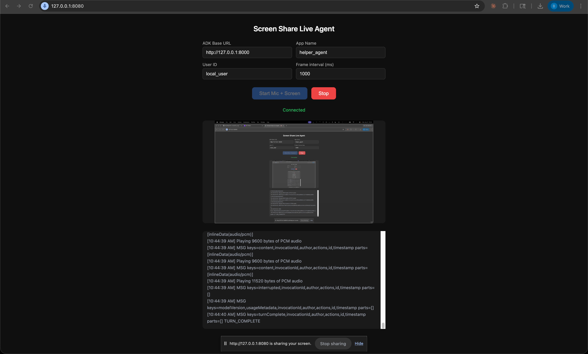

In an earlier post, [I got the standard ADK bidirectional streaming demo running](https://bil.arikan.ca/posts/in-app-live-assistant-part-1-google-adk-bidirectional-streaming-demo/) with both microphone and camera. The model can hear me and see me --- it describes what is on camera while maintaining a fluid voice conversation. That confirms the multimodal pipeline works.

But pointing the camera at my face is not useful for my goal of a in-product assistance agent. I need the model to see the *application*, not the user. In this post I swap the camera feed for a 1 FPS screen capture, so the agent can watch me use an application and talk me through what I am trying to do.

## Why the ADK Dev UI Is Not Enough

The built-in ADK Dev UI supports microphone input and camera input via `getUserMedia`. It does not support screen sharing. The `getDisplayMedia` browser API (which captures a screen, window, or tab) is a different code path --- the browser treats camera access and screen access as fundamentally different permissions with different security models. The ADK team has not added screen sharing to the Dev UI yet.

So I need my own client. The good news is that the ADK exposes a standard WebSocket endpoint for live sessions -- we can use the ADK Web Server to route the audio and video created by a new custom web client we will create.

The audio pipeline could have stayed the same but on inspection `audio-processor.js` of the ADK bidi demo targets 22kHz. The Gemini Live 2.5 Flash native audio expects audio at **16,000 Hz PCM** per the [Gemini Live API specification](https://docs.cloud.google.com/vertex-ai/generative-ai/docs/models/gemini/2-5-flash-live-api#live-2.5-flash), so we will write our own targeting the 16kHz sample rate the model expects. For the video source: instead of `getUserMedia` (camera), we will use `getDisplayMedia` (screen share) and send JPEG snapshots at 1 FPS instead of a continuous camera stream.

## Architecture

The setup runs two local servers:
1. **ADK web server** (`adk web` on port 8000) -- handles agent orchestration and the WebSocket connection to Vertex AI.
2. **Static file server** (port 8080) --- serves the custom client (microphone + screen capture).

The client does three things in parallel:
- **Microphone capture:** AudioWorklet resamples to 16kHz mono PCM, sends chunks every 250ms.
- **Screen capture (replaces camera):** `getDisplayMedia` instead of `getUserMedia`. Draws to canvas at 1 FPS, compresses to JPEG, sends as image blob.
- **Audio playback:** Receives and plays back PCM audio from the agent's response stream.


graph TD
    subgraph UserSide["👤 User Side"]
        A[Microphone Input]
        B[Screen Capture]
        C[Speaker Output]
    end

    subgraph BrowserClient["🌐 Custom Web Client"]
        D[WebSocket Client]
    end

    subgraph ADK["⚙️ ADK Web Server :8000"]
        E[WebSocket Endpoint /run_live]
    end

    subgraph VertexAI["☁️ Google Cloud / Vertex AI"]
        F[Vertex AI Live API]
    end

    A -->|16kHz PCM chunks| D
    B -->|1 FPS JPEG snapshots| D
    D -->|Audio + Image blobs| E
    E -->|Streams| F
    F -->|Audio response| E
    E -->|PCM audio| D
    D -->|Playback| C

    A ~~~ B ~~~ C


## Step 1: The Audio Processor

Before the main client, I need an AudioWorklet that handles real-time audio resampling. Browsers typically capture audio at 44.1kHz or 48kHz, but the Gemini Live API expects 16kHz. The worklet runs on a separate thread and forwards resampled Float32 samples to the main thread.

Create `screen_share_live_client/audio-processor.js`:

```javascript
class AudioProcessor extends AudioWorkletProcessor {
  constructor() {
    super();
    this.targetSampleRate = 16000;
    this.originalSampleRate = sampleRate;
    this.resampleRatio = this.originalSampleRate / this.targetSampleRate;
  }

  process(inputs) {
    const input = inputs[0];
    if (input.length > 0) {
      let audioData = input[0];
      if (this.resampleRatio !== 1) {
        audioData = this.resample(audioData);
      }
      this.port.postMessage(audioData);
    }
    return true;
  }

  resample(audioData) {
    const newLength = Math.round(audioData.length / this.resampleRatio);
    const resampled = new Float32Array(newLength);
    for (let i = 0; i < newLength; i += 1) {
      const srcIndex = Math.floor(i * this.resampleRatio);
      resampled[i] = audioData[srcIndex];
    }
    return resampled;
  }
}

registerProcessor('audio-processor', AudioProcessor);
```

This is a nearest-neighbor resample --- not audiophile quality, but perfectly fine for voice. The model does not need pristine audio; it needs intelligible speech at the expected sample rate.

## Step 2: The Client

The main client is a single HTML file. I am keeping everything in one file deliberately -- no build tools, no framework, no dependencies. This makes it easy for anyone to clone and run.

Create `screen_share_live_client/index.html`. I will walk through the key parts rather than pasting the entire file ([the full source is in the repository](https://github.com/bilarikan/live-streaming-agent-with-google-adk/tree/from-camera-to-screen-capture)).

### Connection Setup

The client first creates an ADK session via REST, then opens a WebSocket to the live endpoint:

```javascript
// Create a session
const sessionId = await createSession(baseUrl, appName, userId);

// Open the WebSocket
const wsUrl = toWsUrl(baseUrl,
  `/run_live?app_name=${appName}&user_id=${userId}&session_id=${sessionId}`
);
const ws = new WebSocket(wsUrl);
```

### Sending Audio

Microphone audio flows through the AudioWorklet. The main thread collects PCM chunks and sends them every 250ms:

```javascript
// Collect PCM chunks from the AudioWorklet
workletNode.port.onmessage = (evt) => {
  const pcmChunk = float32ToPCM16(evt.data);
  audioChunks.push(pcmChunk);
};

// Send accumulated audio every 250ms
setInterval(() => {
  if (audioChunks.length === 0) return;
  const merged = concatUint8Arrays(audioChunks);
  audioChunks = [];
  ws.send(JSON.stringify({
    blob: {
      mimeType: 'audio/pcm;rate=16000',
      data: uint8ToBase64(merged)
    }
  }));
}, 250);
```

### Sending Screen Frames

Screen capture uses `getDisplayMedia`. A canvas draws each frame, compresses to JPEG, and sends it at the configured interval (default 1 FPS):

```javascript
// Capture screen
const screenStream = await navigator.mediaDevices.getDisplayMedia({
  video: { frameRate: { ideal: 4, max: 6 } },
  audio: false
});

// Send frames at 1 FPS
setInterval(async () => {
  ctx.drawImage(screenVideoEl, 0, 0, targetW, targetH);
  const blob = await canvas.toBlob('image/jpeg', 0.72);
  const bytes = new Uint8Array(await blob.arrayBuffer());
  ws.send(JSON.stringify({
    blob: { mimeType: 'image/jpeg', data: uint8ToBase64(bytes) }
  }));
}, frameIntervalMs);
```

The frame is scaled down to a max width of 1280px and compressed at 72% JPEG quality. This is a deliberate trade-off -- lower resolution and quality means fewer tokens consumed by the model per frame, which directly reduces cost. In my testing, the model can still accurately identify UI elements at this quality.

### Playing Agent Audio

The agent responds with PCM audio over the same WebSocket. The client decodes the base64 payload, converts from Int16 to Float32, and schedules playback using the Web Audio API:

```javascript
ws.onmessage = (evt) => {
  const payload = JSON.parse(evt.data);
  // Extract audio parts and play them
  for (const part of payload.content.parts) {
    if (part.inline_data?.mime_type?.includes('audio/pcm')) {
      playPcm16(base64ToUint8Array(part.inline_data.data), sampleRate);
    }
  }
};
```

## Step 3: Update the Agent Instruction

Now that the agent is looking at the application instead of the camera, the instruction needs to reflect that change. The Part 1 instruction said "You can see the user through their camera" --- now I swap that out for one that tells the agent it is watching a software interface and should guide the user through it:

```python
instruction="""
# PERSONA
You are a friendly Obsidian assistant. Your goal is to guide users
through the Obsidian note-taking application via live microphone
and screen sharing.

# OPERATIONAL RULES
1. **Visual Guidance:** You are receiving a live video feed of the
   user's screen. Narrate what you see. Use UI-specific terms
   (e.g., "Click the left sidebar icon," "I see you have the
   graph view open").
2. **Brevity & Voice:** This is a live voice conversation. Keep
   responses short and conversational. Avoid long lists. Wait for
   the user to act before giving the next instruction.
3. **Proactive Help:** If the user stalls on a screen, ask:
   "I see you're looking at [Section], would you like help with
   [Task]?"

# KNOWLEDGE GROUNDING
Base your answers on official Obsidian help https://help.obsidian.md/
and community forum https://forum.obsidian.md/ , if you don't know an
answer, say so and suggest the user check the Obsidian help or community
forum.

# DEMO FLOW
- Start by greeting the user: "Hi! I can see your screen -- what
  would you like help with in Obsidian today?"
- Guide them through one task at a time.
"""
```

## Step 4: Run It

Open three terminals.

Terminal 1 --- reauthenticate with gcloud from the project root:
```bash
gcloud auth application-default login
```

Terminal 2 --- ADK server:
```bash
cd live-agent/app
source ../../.venv/bin/activate
adk web --allow_origins http://127.0.0.1:8080 --allow_origins http://localhost:8080
```

Terminal 3 --- client server:
```bash
cd live-agent/app/screen_share_live_client
python3 -m http.server 8080
```

Open `http://127.0.0.1:8080` in Chrome. Fill in the fields:
- ADK Base URL: `http://127.0.0.1:8000`
- App Name: `helper_agent`
- User ID: `local_user`

Click "Start Mic + Screen" and select the window or tab where Obsidian is running.

The agent should greet you and describe what it sees. Try asking it to help you create a new note, set up a daily template, or navigate the graph view.

Here is a screenshot of the custom client:



## What I Learned

**The swap from camera to screen is simpler than expected.** The ADK does not care whether the image blob comes from a camera or a screen capture --- it is just JPEG bytes either way. The only real difference is on the client side: `getDisplayMedia` instead of `getUserMedia`, and a canvas-based frame capture loop instead of the continuous camera stream. The WebSocket protocol, the blob format, and the audio pipeline are identical.

**The `--allow_origins` flag is required.** The custom client runs on a different port (8080) than the ADK server (8000). Without the CORS origin flag, the browser blocks the WebSocket connection. The error shows up in the browser console, not in the ADK server logs, which made it confusing at first.

**Screen share selection matters.** When the browser prompts you to share, you can choose an entire screen, a specific window, or a browser tab. Sharing a specific window (the Obsidian window) gives the cleanest result --- no desktop clutter, no notification banners. If you share the full screen, the model sees everything, including things you might not want it to see.

**The agent can read text in screenshots.** At 1280px width and 72% JPEG quality, the model reliably reads note titles, sidebar items, and settings labels in the Obsidian UI. It sometimes struggles with very small text in dense settings panels, but for primary UI navigation it works well.

**Frame interval is the biggest cost lever.** At 1 FPS, each frame costs roughly 70 tokens. Over a 90-second session that is 90 frames or 6,300 image tokens. Increasing the frame interval to 2000ms (one frame every 2 seconds) halves that cost with minimal impact on guidance quality for most tasks. I will dig into this trade-off later when working on optimization and improvements.

**The server sends URL-safe base64.** Pydantic's JSON serialization of `bytes` fields uses Python's `base64.urlsafe_b64encode`, which substitutes `-` for `+` and `_` for `/`. The browser's `atob()` only handles standard base64 and throws on these characters. The fix is a one-liner before decoding: `const std = b64.replace(/-/g, '+').replace(/_/g, '/');` --- This one caused silent failures --- audio chunks arrived correctly but every single one failed to decode. There were no errors in the server logs; the only clue was in the browser console.

## The Repository

The code is available on [this branch of the GitHub repository](https://github.com/bilarikan/live-streaming-agent-with-google-adk/tree/from-camera-to-screen-capture), with some files omitted for standard security practice (e.g. `.env` and everything in `.venv/`).
