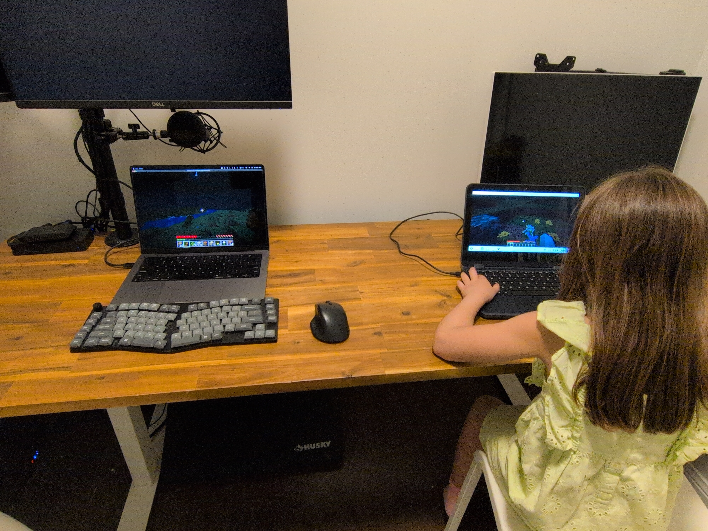

This one is a short detour from the AI workload series. I want to run a Minecraft Java Edition server on the homelab --- for LAN play with my daughter. Her machine is a Lenovo 500W Gen 3 on Linux (ZorinOS) ; mine is a MacBook Pro. The first question : where does a Minecraft server belong in a three-node Proxmox cluster, and how do I stand it up without it touching the AI workloads on pve1?

## Goal

A PaperMC server running as an LXC on pve3, reachable from both laptops over the home LAN. No port forwarding, no public exposure --- this is local play only. The AI stack on pve1 should not know the game session is happening.

## Working assumption

A Minecraft Java server is a Java process. It does not need hardware isolation, GPU access, or a dedicated kernel boundary. LXC is the right container type here --- lower overhead than a VM, faster stop/start, simpler resource control. pve3 (ProDesk #2, i5-7500T, 16 GB RAM) is the designated personal services node per the plan in the previous post. 2 vCPUs and 4 GB RAM (3 GB JVM heap) is sufficient for two concurrent players; the ProDesk still has 12 GB free for other containers.

Placing the server on pve3 also means the AI workloads on pve1 see zero resource contention --- no suspend workflow needed during game sessions.

Here's the placement. The game server lives on pve3 ; the GPU node carries on untouched ; both laptops reach it directly over the LAN.


graph TD
  subgraph LAN["Home LAN --- 192.168.2.0/24"]
    Mac["MacBook Pro<br/>Minecraft Java client"]
    Lenovo["Lenovo 500W Gen 3<br/>ZorinOS · Java client"]
  end

  subgraph PVE1["pve1 --- Workstation"]
    AI["AI inference + agents<br/>RTX 5060 Ti · RX 6650 XT<br/>untouched"]
  end

  subgraph PVE3["pve3 --- ProDesk #2"]
    MC["CT 200 --- minecraft<br/>PaperMC · LXC<br/>2 vCPU · 4 GB · port 25565"]
  end

  Mac -->|"LAN : 25565"| MC
  Lenovo -->|"LAN : 25565"| MC


## Prerequisites

- pve3 installed, clustered, and reachable at `192.168.2.123`
- Both client machines have Minecraft Java Edition licensed and installed the older **version 1.21.4** (client and server versions must match)
- Home router DHCP assigns a stable LAN IP to pve3, or a static lease is configured

## Implementation

### 1. Pull the container template

List what is actually available before downloading --- the point release in the filename changes as Debian updates, so hardcoding it breaks:

```bash
pveam update
pveam available --section system | grep debian-12
```

Expected output on a current system:

```
system  debian-12-standard_12.12-1_amd64.tar.zst
```

Download using the exact name returned:

```bash
TMPL=$(pveam available --section system | grep debian-12 | awk '{print $2}')
pveam download local $TMPL
```

### 2. Create the LXC

```bash
TMPL=$(pveam available --section system | grep debian-12 | awk '{print $2}')
pct create 200 local:vztmpl/$TMPL \
  --hostname minecraft \
  --cores 2 \
  --memory 4096 \
  --swap 512 \
  --rootfs local:8 \
  --net0 name=eth0,bridge=vmbr0,ip=192.168.2.130/24,gw=192.168.2.1 \
  --nameserver 192.168.2.1 \
  --unprivileged 1 \
  --start 1
```

When the container is created successfully, the output ends with SSH host key generation and a warning about systemd:

```
WARN: Systemd 252 detected. You may need to enable nesting.
Task finished with 2 warning(s)!
```

Fix the nesting warning before going further --- without it, systemd inside the container does not behave correctly:

```bash
pct set 200 --features nesting=1
pct reboot 200
```


IP `192.168.2.130` puts the container in my static infra range (.101–.254). Adjust if that address is taken.


### 3. Install Java inside the container

Debian 12 only ships OpenJDK 17 in its standard repos. Java 21 is required for Minecraft 1.21.x, and it is not available via backports either --- `apt-cache search openjdk | grep 21` returns nothing. The reliable path is **Eclipse Temurin** from the Adoptium project, which packages Java 21 directly for Debian:

```bash
pct exec 200 -- bash -c "
  apt-get update -y &&
  apt-get install -y wget gnupg apt-transport-https curl &&
  wget -qO - https://packages.adoptium.net/artifactory/api/gpg/key/public \
    | gpg --dearmor > /etc/apt/trusted.gpg.d/adoptium.gpg &&
  echo 'deb https://packages.adoptium.net/artifactory/deb bookworm main' \
    > /etc/apt/sources.list.d/adoptium.list &&
  apt-get update &&
  apt-get install -y temurin-21-jre
"
```

Verify Java landed:

```bash
pct exec 200 -- java -version
```

Expected output:

```
openjdk version "21.0.11" 2026-04-21 LTS
OpenJDK Runtime Environment Temurin-21.0.11+10 (build 21.0.11+10-LTS)
OpenJDK 64-Bit Server VM Temurin-21.0.11+10 (build 21.0.11+10-LTS, mixed mode, sharing)
```


Temurin is the community build of OpenJDK from the Eclipse Adoptium project --- not a workaround, just a different packaging source. It is what most Minecraft server guides recommend for exactly this reason: distro-packaged Java 21 lags on Debian 12.


### 4. Create the working directory and download PaperMC

Create the directory explicitly before downloading. If it does not exist, `curl` will fail silently with a "No such file or directory" warning and write nothing:

```bash
pct exec 200 -- mkdir -p /opt/minecraft
```

Then pull the latest PaperMC build for 1.21.4 using the API to resolve the build number automatically:

```bash
pct exec 200 -- bash -c "
  VERSION=1.21.4
  BUILD=\$(curl -s https://api.papermc.io/v2/projects/paper/versions/\$VERSION/builds | \
    python3 -c 'import sys,json; builds=json.load(sys.stdin)[\"builds\"]; print(builds[-1][\"build\"])')
  echo \"Downloading PaperMC \$VERSION build \$BUILD...\"
  curl -Lo /opt/minecraft/paper.jar \
    \"https://api.papermc.io/v2/projects/paper/versions/\$VERSION/builds/\$BUILD/downloads/paper-\$VERSION-\$BUILD.jar\"
  echo \"Done.\"
"
```

> I went with 1.21.4 as it was the AI Coding Agent's suggestion and I didn't want to take much time researching the latest PaperMC server build. This got us playing quick --- I'll circle back on updating to a more current minecraft version later on.

Expected output when it works:

```
Downloading PaperMC 1.21.4 build 232...
  % Total    % Received ...
Done.
```

### 5. First-run and EULA acceptance

```bash
pct exec 200 -- bash -c "
  cd /opt/minecraft &&
  java -Xms1G -Xmx3G -jar paper.jar nogui || true &&
  sed -i 's/eula=false/eula=true/' eula.txt
"
```

The server starts, generates config files, prints a EULA warning, and exits --- that is expected. The `|| true` prevents the non-zero exit from stopping the script, and the `sed` accepts the EULA in place. The first run also downloads `mojang_1.21.4.jar` and applies patches, which takes a minute.

Verify EULA was accepted:

```bash
pct exec 200 -- cat /opt/minecraft/eula.txt
# Should contain: eula=true
```

### 6. Create the start script

Heredoc syntax inside `pct exec` strips the shebang line --- the file gets created but `#!/bin/bash` disappears, which causes systemd to fail with `status=203/EXEC` (cannot execute). Use `printf` instead:

```bash
pct exec 200 -- bash -c 'printf "#!/bin/bash\ncd /opt/minecraft\nexec java -Xms1G -Xmx3G -XX:+UseG1GC -XX:+ParallelRefProcEnabled -XX:MaxGCPauseMillis=200 -XX:+UnlockExperimentalVMOptions -XX:+DisableExplicitGC -jar paper.jar nogui\n" > /opt/minecraft/start.sh && chmod +x /opt/minecraft/start.sh'
```

Verify the shebang is present:

```bash
pct exec 200 -- cat /opt/minecraft/start.sh
```

Expected:

```bash
#!/bin/bash
cd /opt/minecraft
exec java -Xms1G -Xmx3G -XX:+UseG1GC -XX:+ParallelRefProcEnabled -XX:MaxGCPauseMillis=200 -XX:+UnlockExperimentalVMOptions -XX:+DisableExplicitGC -jar paper.jar nogui
```


The G1GC flags are Aikar's recommended JVM args for PaperMC --- they meaningfully reduce GC pause spikes at the cost of nothing. Use them by default.


### 7. Create the systemd service

```bash
pct exec 200 -- bash -c "cat > /etc/systemd/system/minecraft.service << 'EOF'
[Unit]
Description=PaperMC Minecraft Server
After=network.target

[Service]
Type=simple
User=root
WorkingDirectory=/opt/minecraft
ExecStart=/opt/minecraft/start.sh
Restart=on-failure
RestartSec=5s

[Install]
WantedBy=multi-user.target
EOF
systemctl daemon-reload && systemctl enable --now minecraft"
```

The server takes 30--60 seconds to fully start on first run (world generation). Wait, then check:

```bash
pct exec 200 -- systemctl status minecraft
```

You are looking for `Active: active (running)` and this line in the log output:

```
[INFO]: Done (13.562s)! For help, type "help"
```

That is the server's ready signal. Verify the port is listening:

```bash
pct exec 200 -- ss -tlnp | grep 25565
```

### 8. Set up peaceful mode

By default the server runs in survival mode with hostile mobs enabled. For casual play, disable hostile mobs and set peaceful difficulty. The safe way to do this is to remove any existing `difficulty` and `spawn-monsters` entries before appending --- `server.properties` can accumulate duplicate keys if you append without cleaning first, and the first value wins:

```bash
pct exec 200 -- bash -c "
  sed -i '/^difficulty=/d' /opt/minecraft/server.properties &&
  sed -i '/^spawn-monsters=/d' /opt/minecraft/server.properties &&
  echo 'difficulty=peaceful' >> /opt/minecraft/server.properties &&
  echo 'spawn-monsters=false' >> /opt/minecraft/server.properties
"
```

Verify the file has no duplicates:

```bash
pct exec 200 -- grep -E "difficulty|spawn-monsters" /opt/minecraft/server.properties
```

Expected --- exactly two lines:

```
difficulty=peaceful
spawn-monsters=false
```

Restart to apply:

```bash
pct exec 200 -- systemctl restart minecraft
```

To confirm peaceful mode is active from inside the game, type `/difficulty` in chat. The debug overlay (`F3`) also shows `Difficulty: Peaceful` on the right-hand panel.

### 9. Connect the clients

**From the MacBook Pro:**

1. Open Minecraft Launcher → **Installations** → **New Installation**
2. Under **Version**, select `release 1.21.4` --- the client version must match the server exactly
3. Launch using that installation
4. In-game: **Multiplayer → Add Server**
5. Server Address: `192.168.2.130`
6. Done → Join Server

**From the Lenovo 500W Gen 3 (ZorinOS):**

Same steps. Both machines are on the same home LAN, so no port forwarding is needed.


The client version must match the server version exactly. If the server shows a red `✗` with `Paper 1.21.4` in the server list, your client is on a different version. Fix it in the launcher under Installations by pinning to `release 1.21.4`. Mismatched versions produce an "Outdated client" or "Outdated server" error on connection.


## Proxmox management

Stop, start, and check the container:

```bash
pct stop 200      # graceful stop
pct start 200     # bring it back
pct status 200    # running / stopped
```

To stop just the Minecraft service without stopping the container:

```bash
pct exec 200 -- systemctl stop minecraft
pct exec 200 -- systemctl start minecraft
```

The official [Proxmox VE mobile app](https://apps.apple.com/app/proxmox-virtual-environment/id1665797454) (iOS and Android) can also start and stop the container. Useful for spinning the server up just before a session without opening a terminal.

## A note on AI workloads and resource contention

Since the server runs on pve3 and the AI workloads (Ollama, ComfyUI, etc.) run on pve1, there is no contention --- separate physical nodes, same LAN. No suspend workflow needed during game sessions. If the server were temporarily on pve1 instead, pausing AI VMs while playing is straightforward:

```bash
qm suspend <vmid>   # suspend VM to RAM, fast resume
qm resume <vmid>
pct stop <ctid>     # stop an LXC (e.g. one running Ollama)
pct start <ctid>
```

For this setup, that is not a concern.

## What changed

A few things in the initial plan did not work out in the actual pve3 setup:

- **Java 21 is not in Debian 12 repos or backports.** `apt-cache search openjdk` returns only Java 17. Switched to Eclipse Temurin from Adoptium.
- **Heredoc via `pct exec` strips the shebang line.** The start script was created without `#!/bin/bash`, causing systemd `status=203/EXEC`. Fixed with `printf` instead of heredoc.
- **Duplicate `difficulty=` keys in `server.properties`.** Appending without removing the existing key left two `difficulty=` lines; the first one (easy) won. Fixed with `sed -i '/^difficulty=/d'` before appending.

And this is the whole point of the detour. It was fun playing Minecraft together and watching her explore and build for the first time.




