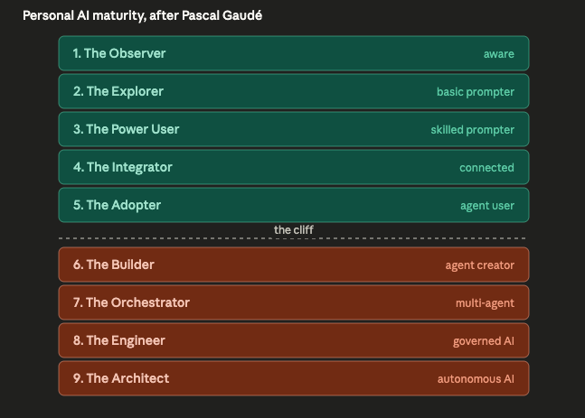
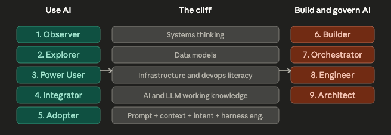
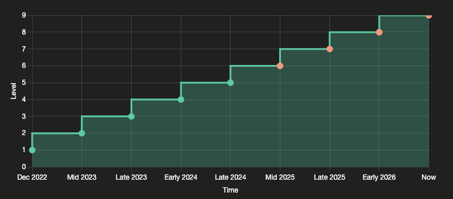
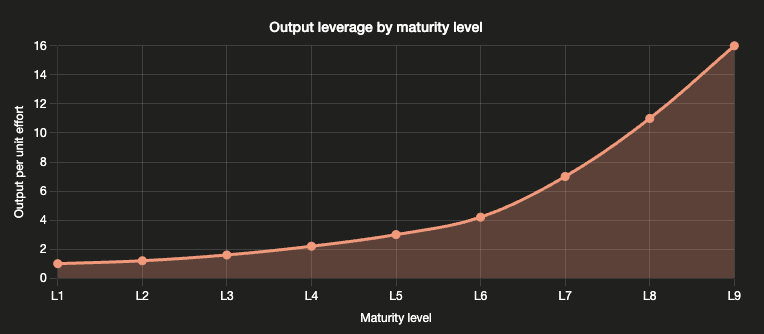
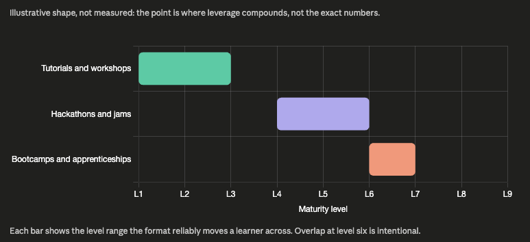

Last year many organizations had bought every employee a Microsoft 365 Copilot licence and are now wondering loudly, in measured corporate language most likely, why the productivity multiplication had not occurred. The honest answer is uncomfortable : tool access is not capability. The licence is the easy part, it's the [symbolic self-completion](https://en.wikipedia.org/wiki/Symbolic_self-completion_theory) that doesn't actually get you there. What sits between a Copilot seat and a productive person is a learning ladder that most rollouts quietly skip. In this post I want to walk through that ladder, name the cliff inside it, and share the journey I have actually walked --- not as a model of how it should be done, but as calibration for what each step feels like in practice.

The frame for this work comes from [Pascal Gaudé](https://www.linkedin.com/in/pascal-gaude/), who proposed the nine-level maturity model that **AI Spark** is now using to plan our hackathons, tutorials, and bootcamps. The model below is his ; the 'cliff' take in this post is mine.

## Goal

Give leaders a mental model of personal AI maturity that matches what their teams actually need to *learn* at each stage, and that shows where most rollouts stall.

## Working assumption

Maturity is a learning ladder, not a status badge, a personality test, or a job description. It is best read as a planning tool : where is this person now, and what is the next move that genuinely changes what they can do ? Most people benefit from reaching level seven. Few need to push beyond it.

## The model : nine levels

Here is Pascal's model after I added my 'cliff' concept :

*High resolution : [open full image on GitHub](https://github.com/bilarikan/bilarikan.github.io/blob/main/content/posts/nine-levels-of-personal-ai-maturity/SCR-20260503-HQ1.png).*

The first five levels describe how a person *uses* AI : from being aware of it, to prompting it, to integrating it into the tools where work actually happens. Levels six through nine describe how a person *builds and governs* AI : creating agents, orchestrating them, and shaping the systems and policies they live in.

I think the model holds. I also think the most important thing about it is something you do not see at first glance : there is a cliff in the middle.

## The cliff between using and building

The largest jump in the model is not from level one to two ; it is from level five to six. Up to level five you are an increasingly skilled user of AI. From level six you are creating something --- an agent, a tool, a small system --- that other people use. That sounds incremental. It is not. The skill stack you need to cross changes shape entirely :

*High resolution : [open full image on GitHub](https://github.com/bilarikan/bilarikan.github.io/blob/main/content/posts/nine-levels-of-personal-ai-maturity/SCR-20260503-HQ2.png).*

This is the move that defeats most "we gave everyone an AI tool" rollouts. Adoption stalls at level three or four because the next step requires capabilities the organisation never funded learning and enablement for. [Nate B Jones has been making this point well](https://www.youtube.com/watch?v=QWzLPn164w0) : he describes prompt engineering, context engineering, and intent engineering as three separate disciplines, and the second and third only become real once you are *building* something rather than chatting with something. Until you have to design what an agent should know, what it should do without you, and what it must never do, "engineer" was just a word.

The leaders I see stuck are stuck here. Their teams plateau at level three or four. They have been told, often by the vendor, that the next step is "more prompts" or "more use cases." It is not. The next step is a different curriculum.

## Personal pilot purgatory

Pascal's highlighted 'pilot purgatory' as a important risk to consider at the portfolio level : initiatives that get to a demo and then never reach production. Individuals have the same problem at the personal level. Most people get stuck at one specific level on this ladder for a long time, sometimes years, because the workflow they have works *well enough* and nothing in their day-to-day is forcing the next jump.

In my experience two things tend to break that stall. The first is deliberate new tooling : reaching for the model or platform you have been avoiding because it would force you to rethink your workflow. The second is role or project pressure : being asked to do something that the level you are at simply cannot do, and having to climb to deliver it. Neither happens by itself. Both have to be designed in.

## Walking the ladder : nine moments from my own path

What follows is calibration, not autobiography. I am still learning at every stage and have no interest in pretending otherwise. But the nine levels of the model map almost exactly onto nine moments in my own path with AI, and writing them down made the model concrete for me. Maybe they do the same for you.

**Level 1 --- The Observer.** The first month ChatGPT was publicly available, I read about it and watched explainers. I was not using it. I was forming a frame.

**Level 2 --- The Explorer.** I was finishing the last modules of my Secure Software Development program with Coding for Veterans and the University of Ottawa, and the slow teacher-by-email cycle was killing my pace on Python and C++ questions. I started using ChatGPT as a tutor. The revelation was not the answers ; it was the responsiveness.

**Level 3 --- The Power User.** As I progressed, I learned that the way I asked the question changed the quality of what I learned, not just what I got back. Writing better prompts, supplying context, and explicitly directing the model to *teach me* rather than answer for me became a discipline of its own.

**Level 4 --- The Integrator.** While completing the program I joined the Learning Guild's xAPI cohort and started building custom GPTs --- which had only just become available to subscribers --- around the learning-data analysis workflow. I also began participating in Sage hackathons, co-leading teams. That mattered for a reason I had not expected : working alongside actual ML scientists and engineers showed me what they did differently with AI, and what I had been missing about how models and pipelines really fit together.

**Level 5 --- The Adopter.** I subscribed to Google Gemini and made Gemini Gems a standard part of my daily communication workflow. More Sage hackathons followed, and this time I was leading teams to wins. The thing I learned was not the tooling ; it was that I could decompose a problem statement into tentative solutions and then collaborate with people who had far deeper AI and ML expertise than I did, to get us to finished prototypes.

*High resolution : [open full image on GitHub](https://github.com/bilarikan/bilarikan.github.io/blob/main/content/posts/nine-levels-of-personal-ai-maturity/SCR-20260503-HQ3.png).*

**Level 6 --- The Builder.** I began exploring Google AI Studio, customising multimodal live Gemini models for real-world guidance use cases. This was the first level where I was clearly building something for someone else to use, and where I started running into the limits of model capability rather than the limits of my prompting. I started to dig deeper into context windows, tokenization, AI Development Kits, and how an LLM is turned into an agent by wrapping it with more and more capabilities.

**Level 7 --- The Orchestrator.** When being asked to deliver real AI solutions to business challenges, I went deep on Anthropic's Claude Code and OpenAI's Codex. The interesting work was no longer "use the model" ; it was understanding how cloud-only agents and local-asset agents collaborated on the same task --- what each one knew, where state lived, how handoffs were structured. Orchestration is its own skill, and it is not a longer prompt.

**Level 8 --- The Engineer.** A live multimodal model project I owned needed to clear governance gates. That forced me deep into the architecture I had chosen, what liability surfaces it created, and how to document them so reviewers could agree or push back on a real artifact rather than a sketch. Documentation here was not paperwork ; it was the level-up as I applied what I had learned in the Secure Software Development program, thanks in part to ChatGPT back at Level 2.

**Level 9 --- The Architect.** I am now building a local multi-GPU, Proxmox-based setup running an OpenClaw-style stack for general agent workflows that I can text message, supplemented by a PI-based coding agent. The intent is an always-on system that I just need to power, not vendor's token based usage, and I can that supplement with frontier models when the work is serious enough to warrant them. I want this to double as a test bed for rapidly creating and tearing down approaches to new agentic instruction approaches and AI+DevOps architecture to create responsive learning experiences in many media types.

I am not the greatest-power-using-in-the-world at any of these levels. The honest claim is more modest : I have walked through them, and the move between any two of them was usually a tooling change, a project that demanded more, or a challenge I had to face.

## Most people need to reach level seven

The top performers in the next decade will be the ones who learn to orchestrate. Level seven is where you stop doing the work sequentially yourself and start directing a small set of agents to do parts of it in parallel, then merging the outputs. That is a real cognitive shift, and it is the level at which a single person's leverage compounds.

People who reach level seven will benefit most. People who do not will still benefit from levels three through six --- the productivity gains there are real --- but the gap will widen between knowledge workers who orchestrate and those who do not. I am not predicting a winner-takes-all market ; I am saying the curve gets steeper above the cliff.

*High resolution : [open full image on GitHub](https://github.com/bilarikan/bilarikan.github.io/blob/main/content/posts/nine-levels-of-personal-ai-maturity/SCR-20260503-HQ4.png).*

Levels eight and nine read more like role descriptions than continued personal stages. The Engineer is the person who builds the guardrails ; the Architect is the person who designs systems that improve themselves. Most organisations may only need a limited amount of each and may not need most of their people to be either.

## Design for the personas you serve, not the ones you wish you served

There is a related trap on the *building* side that follows from this. Not every user of an AI product wants to tinker. Some people just want the AI to do the thing. They are happy at level two or three, and a product designed well for them will respect that.

A customer-facing AI assistant like the in-app assistants finance teams now expect is designed for level-two users : people who know AI exists and want it to help them right now, in the application they already use. An internal Learning Program Owner agent is designed for level-three or four operators : people who can prompt and integrate but do not want to build the agent themselves. That is correct, not a failure of ambition. Confusing personal maturity with product design --- assuming everyone will eventually want to be a builder and shipping accordingly --- is its own form of stalling.

*High resolution : [open full image on GitHub](https://github.com/bilarikan/bilarikan.github.io/blob/main/content/posts/nine-levels-of-personal-ai-maturity/SCR-20260503-HQ5.png).*

## What this means for Learning & Development

The model gives a clean way to map intervention shape to learner stage. My current thoughts :

1. Tutorials and short workshops carry levels one to three. The work is to make a habit out of using AI deliberately.
2. Hackathons and structured AI-jams carry levels four to six. The work is to put people next to builders and let the pressure of producing an immediate prototype do the teaching.
3. Bootcamps, apprenticeships, and project-based learning are the only formats I think can move people to levels six and seven. The work is sustained practice with feedback in a real context.

*High resolution : [open full image on GitHub](https://github.com/bilarikan/bilarikan.github.io/blob/main/content/posts/nine-levels-of-personal-ai-maturity/SCR-20260503-HQ5.png).*

The harder lesson, and the one I keep returning to as a learning program owner, is that an AI acceleration team cannot do the AI project for the team and call it done, that's just a crutch. What matters is that we leave skills behind when the project ends. The maturity model gives us clear learning objectives and personas at every scale of effort, from a one-hour tutorial to a multi-month engagement, so the team we worked with can take the next project on themselves --- and possibly the one after that without us.

## Risk or limitation

The levels are approximations, not certifications, and people sit between them constantly. The model is most useful as a planning and design tool, and least useful as a performance review. If a colleague tells me they are "a level five," that gives me context of how we can converse, not what credentials they have.

There is also a real risk of using the ladder to make people feel small. Anyone using this internally should be careful : the model is a map, not a leaderboard.

## Next step

For now, AI Spark is using the model to design our first wave of interventions : a hackathon series scoped at levels four to six, a tutorial track for levels one to three, and a tighter bootcamp pilot aimed at the small group ready to cross from five to six. Next iteration, I want to test whether explicitly naming the cliff at level six in the bootcamp's opening session changes how learners self-place at the start --- and whether that changes what they actually finish able to do.

If you are a leader whose AI rollout has stalled, the most useful question I can suggest is not "how do we drive more usage." It is : where on this ladder is each team really standing, and what is the next move that genuinely changes what they can do ?
