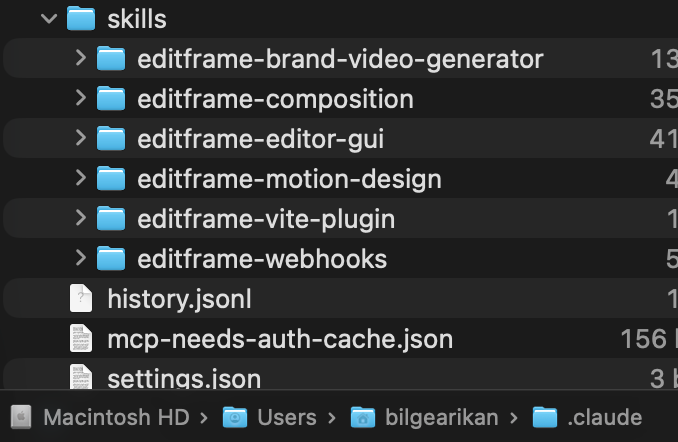
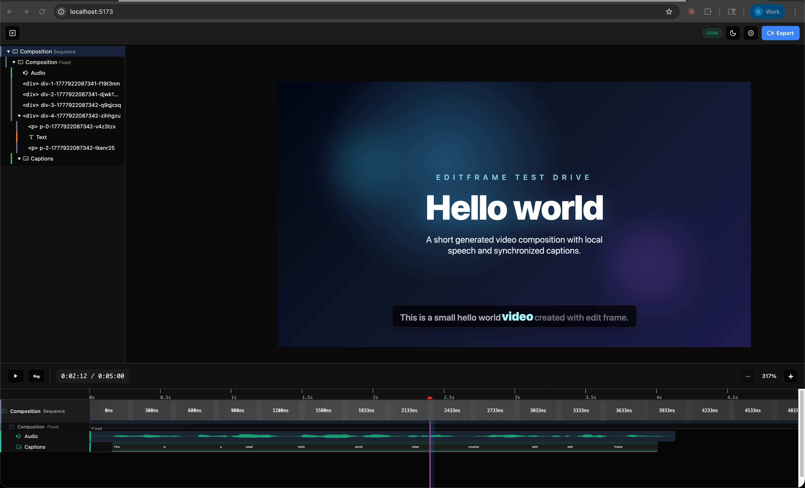

In this first experiment I wanted to answer a small question : can I use Editframe and an AI coding agent to create, preview, and render a short video from code, mostly on my local machine?

The video itself was intentionally trivial. A `Hello world` title, a short synthetic voiceover, and a bottom caption. The point was not creative quality yet. The point was to test the workflow : can video production start to look more like a dev workflow, where the composition is code, the output is reproducible, and the agent can help move through the rough edges?

## Goal

The goal for this first pass was to create the smallest possible Editframe project and render a short MP4.

My working assumption was simple : if the hello-world path is smooth enough, then I can start testing more realistic learning and product video scenarios later. If it is not smooth, the failure points are still useful. They show where an agentic video workflow needs guardrails.

In this case, I wanted to keep the stack mostly local :

1. Scaffold an Editframe project on my workstation.
2. Use an agentic coding harness, e.g. Claude Code, Codex, Cursor, etc.
3. Use the Editframe agent skills installed locally.
4. Preview the composition locally.
5. Render an MP4 locally from the command line.

The important part is that these were pieces of a stack the agent and I could see and control : HTML, CSS, local assets, generated speech, and a render command. That changed the iteration model. I could ask for a small change, the agent could make a small code or asset change, and the next output stayed close to the previous one. This is different from asking an opaque video generation system to recreate the whole thing somewhere else, then hoping the new result does not drift in a completely different direction.

## What is in the stack

Before walking through what happened, it helps to name the layers up front. I will come back to each of these in their own diagram later.

1. **Control layer** : me, the coding agent, and the Editframe skills the agent reads.
2. **Source layer** : the inspectable project pieces -- HTML, CSS, the voiceover audio file, the subtitle text.
3. **Runtime layer** : the local tools that turn the source layer into a preview and a final MP4 -- `@editframe/elements`, the Vite dev server, the Editframe CLI, and a headless Chrome via Playwright.

The point of naming the layers up front is that every change I made in this experiment landed in exactly one of them. That was the part that started to feel like a software workflow.

## Setup

Before creating the project, I installed the Editframe skills for the agent :

```shell
npx skills add editframe/skills
```

On my machine, those skills were saved under `~/.claude/skills/`. Other Codex and Cursor were still able to read them from there, which meant the agent could use Editframe-specific guidance while working in the repo.



Then I scaffolded the first experiment :

```shell
npm create @editframe@latest
```

I selected the HTML starter, named the folder `01-hello-world`, and chose to install the agent skills globally. The generated project had the expected next step :

```shell
cd 01-hello-world
npm start
```

That launched a local Vite preview at `http://localhost:5173/`.

At this point the preview was reachable, but visually empty. That was already useful. It confirmed that the scaffold and preview server worked, but that I still needed to inspect the generated composition and turn the placeholder into a real video scene.

## Building the first composition

From there, I asked the agent to use Editframe inside `01-hello-world/` to create a short hello-world video with speech and captions.

The first generated version had :

1. A `Hello world` title.
2. A local voiceover asset generated with macOS `say`.
3. A bottom caption for the spoken sentence.
4. A 5-second composition with explicit `1920x1080` dimensions.

The narration sentence was :

> This is a small hello world video created with edit frame.

There were a few small iteration points. I initially made a grammar mistake in the prompt, so the first narration said `This a small...`. After correcting the text, the generated audio still sounded like it was skipping over `is`, so the agent regenerated the voiceover at a slower speech rate and added a slight pause after `is`. The file name was changed as well, so the browser would not keep playing stale cached audio.

There was also a visual correction. The letters in `Hello` were too tight, especially the `ll`, so the agent relaxed the letter spacing.

This is the part I like about the workflow. The iteration was not about opening a timeline editor and nudging clips around. It was closer to reviewing a branch : observe, ask for a change, update code and assets, preview again.



## Rendering

The preview UI had an Export button, but when I selected it, I could not find a saved MP4. I checked the usual places, including `Downloads`, and there was no final video file.

The next step was to render through the CLI. This exposed a few useful details.

The project guidance suggested :

```shell
npx editframe render src/index.js
```

But that failed because npm could not resolve the executable in this install. The package did declare an `editframe` binary, but `node_modules/.bin` was missing. The workaround was to call the installed CLI entrypoint directly.

The next correction was that the CLI expected a directory, not `src/index.js`. The successful shape was :

```shell
node node_modules/@editframe/cli/dist/index.js render . --output "hello-world.mp4" --include-audio
```

The first render attempt also failed under the agent sandbox while launching the local Chrome/Playwright render process. Running outside the sandbox allowed the local render to start.

Then another issue appeared : the render failed when using Editframe's `ef-captions` components.

The error was :

```text
TypeError: this._$EM is not a function
```

That happened with the word-level caption parts and again with the simpler `ef-captions-segment`. For this first experiment, I changed the caption to a plain static subtitle block at the bottom of the frame. With that workaround, the local render completed successfully.

The result was a 5-second MP4 :

```text
01-hello-world/hello-world.mp4
```

I reviewed the rendered file, and for the purpose of this first experiment, it looked good. The rendered MP4 is in the repo : [hello-world.mp4 on GitHub](https://github.com/bilarikan/bilarikan.github.io/blob/main/content/posts/video-production-to-dev-workflow-editframe-test-drive/hello-world.mp4).

## What I learned

The main learning is that a code-as-video workflow is real enough to continue testing, but the first pass still needs engineering judgement.

The good parts :

1. The project scaffold was straightforward.
2. The local preview worked.
3. The agent could read Editframe-specific skills and apply the composition model.
4. The voiceover could be generated locally.
5. The final MP4 was rendered locally.
6. The video was reproducible from files in the project.

The rough edges were also useful :

1. The preview UI export did not visibly save a file.
2. The documented `npx editframe render src/index.js` path did not work in this local install.
3. The CLI render required a directory, not a file path.
4. The render process needed to run outside the agent sandbox because it launched Chrome/Playwright.
5. `ef-captions` caused render failures, so I used a static subtitle block instead.

That last point matters. Captions are important for learning content, accessibility, and internal product communication. For this first video, a static subtitle was acceptable. For future experiments, I need to test whether timed captions work reliably through another approach, another package version, or a different render path.

## Architecture : how the pieces fit

I want to take the same three layers I named above and look at each one on its own. The original instinct was to cram all of this into one big diagram, but that made it harder to see what each part was actually responsible for.

### Control layer

This is who is making decisions and who is making changes.


flowchart TD
  human[Me<br/>review and direction]
  agent[Coding agent<br/>code and asset edits]
  skills[Editframe skills<br/>local guidance]
  human <--> agent
  skills --> agent


The agent does the typing. The skills tell it how Editframe expects things to be wired. I provide the direction and the quality read. None of this needs anything remote.

### Source layer

These are the inspectable pieces the agent edits and that I review.


flowchart TD
  html[index.html<br/>scene structure]
  css[styles.css plus Tailwind<br/>visual system]
  subtitle[static subtitle block<br/>caption text]
  say[macOS say<br/>speech generation]
  convert[afconvert<br/>audio conversion]
  voice[voiceover-v2.m4a<br/>local narration asset]

  say --> convert
  convert --> voice


Each box here is something I could have edited by hand. The voiceover is generated, but it is generated locally, and it lands in the project as a file the agent can replace. There is nothing in this layer that would be hard to diff in a pull request.

### The iteration loop

This is the part that felt different from a normal video edit cycle. It looked less like driving a timeline and more like reviewing and providing feedback.


flowchart TD
  preview[Browser preview<br/>visual and audio review]
  human[Me<br/>spot a problem]
  agent[Cursor agent<br/>small targeted change]
  source[Source files and assets]

  preview --> human
  human --> agent
  agent --> source
  source --> preview


The grammar correction, the slowed-down narration, the relaxed letter spacing, and the swap from `ef-captions` to a static subtitle block were each one trip around this loop. Spot the issue, ask for a change, agent edits one or two files, preview updates.

### Runtime path

This is what actually runs to produce the preview and the final MP4. The grouping labels matter for later, when we look at what the same path costs in production.


flowchart TD
  subgraph localOnly ["Local only -- no metering"]
    direction LR
    source[Source files<br/>html, css, voice, subtitle]
    elements["@editframe/elements<br/>web components and timeline"]
    vite[Vite dev server<br/>local preview]
    cli[Editframe CLI<br/>render command]
    chrome["Local Chrome/Playwright<br/>headless render"]
  end

  subgraph checkpoint [Human checkpoint]
    browser[Browser preview]
  end

  subgraph output [Final artifact]
    mp4[hello-world.mp4]
  end

  source --> elements
  elements --> vite
  vite --> browser
  source --> cli
  cli --> chrome
  chrome --> mp4


Everything in the `Local only` group ran on my machine, including the render. Nothing in this experiment touched cloud infrastructure or used a metered service. That changes once you scale this past one developer, which is what the cost section will come back to.

## Traditional vs code-as-video for a feature release

Now I want to apply the same loop to something more realistic : a SaaS product team releasing a new feature, where marketing and learning content both have to ship at the same time.

The teams and roles usually involved look something like this -- the exact order of handoffs varies by org :

- **Product team** -- owns the feature, writes the spec, knows the technical detail.
- **Learning program owner** -- owns the learning portfolio and decides what depth of coverage each release deserves.
- **Learning designer and developer** -- turns the brief into scripts, storyboards, and the actual video assets.
- **Product content team** -- writes and reviews in-product copy and any voiceover scripts.
- **Product marketing manager** -- owns the release narrative and the customer-facing positioning.

In a traditional workflow, this cast feeds work into a single execution role, with edit cycles bouncing back through it. In a code-as-video workflow, the same roster exists, but the medium changes.

### Traditional path


flowchart TD
  subgraph stakeholders[Stakeholder input]
    direction LR
    spec[Product team<br/>feature spec]
    lpo[Learning program owner<br/>learning brief]
    pc[Product content team<br/>copy and voiceover scripts]
    pmm[Product marketing manager<br/>release narrative]
  end

  ldd[Learning designer and developer<br/>video editing]
  exportv[Export MP4 per artifact]
  review[Stakeholder review]
  loc[Per-locale rework]
  final[Final assets]

  stakeholders --> ldd
  ldd --> exportv
  exportv --> review
  review -->|change requests| ldd
  exportv --> loc
  loc --> ldd
  review --> final


The order of upstream handoffs varies by org. What stays consistent is that the work serializes through one execution role, and that every change goes back to that role.

The pain points are predictable. Every change means reopening a project file, finding the right timeline, modifying it, exporting again, and hoping nothing else shifted. Localization is a separate redo of most of that work, per locale. Re-editing for a v1.1 patch a few weeks later means tracking down the project file and rebuilding mental context. I'm already starting to hyperventilate just thinking about it...


### Code-as-video path

The same cast, but the medium is a repository instead of a project file, and the agent is doing the assembly from approved components.


flowchart TD
  spec[Product team<br/>feature spec in repo]
  components[Approved reusable<br/>video components]
  agent[Coding agent<br/>assembles composition]
  pr[Pull request<br/>composition + assets]
  lpo[Learning program owner<br/>review on PR]
  ldd[Learning designer and developer<br/>review on PR]
  pc[Product content team<br/>review on PR]
  pmm[Product marketing manager<br/>review on PR]
  preview[Local CLI render<br/>preview MP4]
  cloud[Cloud render on release tag<br/>parallel locales]
  final[Final assets]

  spec --> agent
  components --> agent
  agent --> pr
  pr --> lpo
  pr --> ldd
  pr --> pc
  pr --> pmm
  lpo -->|comments| agent
  ldd -->|comments| agent
  pc -->|comments| agent
  pmm -->|comments| agent
  pr --> preview
  preview --> pmm
  pr --> cloud
  cloud --> final


The handoffs have not disappeared. The narrative still needs the marketing manager. The learning brief still needs the program owner. Copy still needs the content team. What changed is what each of those people is reviewing : a diff of text, an asset file, or a parameter change, instead of a re-rendered MP4 they have to scrub through to find what moved.

### Code-as-video path when reviewers are not in the PR flow

The path I just described assumes the stakeholders are comfortable opening a pull request, reading text and asset diffs, and leaving inline comments. That is true for some engineering-adjacent teams. It is often not true for marketing, learning, or product content reviewers, who reasonably expect to review the actual rendered video, not the code that produces it.

That does not break the code-as-video model. It just changes the review surface.


flowchart TD
  spec[Product team<br/>feature spec in repo]
  components[Approved reusable<br/>video components]
  agent[Cursor agent<br/>assembles composition]
  preview[Preview render<br/>local CLI or low-quality cloud]
  surface[Review surface<br/>shared folder or video review tool]

  subgraph stakeholders[Stakeholders review video]
    direction LR
    lpo[Learning program owner]
    ldd[Learning designer and developer]
    pc[Product content team]
    pmm[Product marketing manager]
  end

  coord[Coordinator<br/>producer, PM, or learning developer<br/>translates feedback into prompts]
  cloud[Cloud render on approval<br/>parallel locales]
  final[Final assets]

  spec --> agent
  components --> agent
  agent --> preview
  preview --> surface
  surface --> stakeholders
  stakeholders -->|comments| coord
  coord -->|prompts| agent
  surface -->|approval| cloud
  cloud --> final


The agent and the component library stay the same. What changes is that the preview render is automatically posted to a surface the reviewers already use -- a shared video folder, a video review tool with timecoded comments, or a streaming preview link -- and a single coordinator (a producer, PM, or learning developer) translates their feedback into the next round of agent prompts. Reviewers comment on what they actually see. The composition stays in the repo, parameterized and reusable.

The trade-off is one extra hop -- each review round is a render-and-post rather than a diff -- and a coordinator role that has to exist explicitly. The point is that the workflow degrades gracefully : PR-native review when the reviewers are technical, render-and-post review when they are not, and the underlying composition does not change in either case.

### Where the time savings show up

I am not putting hours on these -- the numbers depend on the team. But the directional shape is consistent.

| Step | Traditional | Code-as-video |
|---|---|---|
| First draft of the video | Days to weeks of video edits after the script is final | Hours, once the spec and approved components exist |
| Single edit round | Re-open project, edit timeline, re-export, redistribute | Edit a file, preview locally, push a commit |
| Multi-stakeholder review | Sequential, gated by export | Parallel, gated by PR review |
| Localization to 12 locales | 12 sequential redo passes | One parallel cloud render on release tag |
| v1.1 patch a month later | Find the project file, rebuild context, edit, re-export | Change a parameter, re-render |

The biggest win is not actually any single step. It is that the team stops paying the "open the project, find context, export, distribute" tax on every change. That tax is what makes traditional video production feel disproportionately expensive for small corrections.

This same comparison comes back in the cost section below, this time as actual dollars.

## From hello-world to a product release workflow

> Working assumption : a SaaS product team releasing a new feature already has structured source material -- release notes, PR descriptions, design tokens, screenshots, in-product copy. That is the input the agent should be parameterizing video from.

The hello-world experiment was a baseline. The interesting question is whether the same loop survives contact with a real release.

### The model I am testing

1. **Inputs** : release notes, feature spec, screenshots, design tokens, brand kit, voiceover script, locale list.
2. **Composition** : the agent assembles the video from approved reusable components -- intro, feature card, CTA, outro -- and parameterizes them with the release inputs. This is the part that connects forward into experiment 05.
3. **Review** : the composition lives in a pull request. Marketing, learning, and product owners review text and asset diffs, not re-exported MP4s.
4. **Render** : local CLI render for review, cloud render for production output and locale fan-out.
5. **Distribution** : final MP4s land in YouTube, the marketing CMS, the in-product education surface, and the internal LMS for the learning team.

### The artifacts one composition can produce

A single feature release usually needs more than one video. Treated as code, one composition can fan out into :

1. A 30-second release announcement for social.
2. A 60 to 90-second feature walkthrough for the marketing site.
3. A short, low-narration in-product feature tour.
4. A 3 to 5-minute customer enablement module for the learning team.
5. A short internal release-readiness clip.
6. Localized variants of any of the above.

The point is not to brute-force every artifact from one composition. The point is that they all share inputs -- the same feature copy, the same brand kit, the same screenshots, the same voiceover script -- and that those inputs now live in a repository instead of in five different project files.

### Release timeline


flowchart TD
  t2w[T-2w<br/>draft compositions<br/>from feature spec]
  t1w[T-1w<br/>marketing and learning<br/>review on PR]
  release[Release day<br/>cloud render on tag<br/>distribute]
  post[Post-release<br/>v1.1 patch updates<br/>regenerate from parameters]

  t2w --> t1w
  t1w --> release
  release --> post
  post --> t2w


### What this only works with

Two constraints worth naming directly :

1. **An approved reusable component library.** Otherwise the agent is regenerating from scratch every time, which is exactly the failure mode I want to avoid. This is what experiment 05 is reserved for.
2. **A real content review process.** Marketing and learning still have to sign off on text and visuals. The pull request is the place that happens. Without it, the workflow just produces faster bad video.

> Outcome : this first experiment succeeded as a local baseline. What happens when the same loop has to absorb and produce real release content ?

## What changes when this hits production -- the monetization model

The hello-world experiment lived entirely inside Editframe's Free tier. The local CLI render did not touch any metered service. That is not the production case once a real product team starts shipping releases through this workflow.

### How Editframe charges

Editframe's pricing has two parts that matter here.

1. **Tiered subscription, scoped by total employee count :**
   - Free up to 3 employees.
   - Team for 4-10 employees, $49 per month.
   - Cloud for 11-20 employees, or anyone who needs cloud infrastructure, $99 per month plus usage.
   - Enterprise for 21 or more employees, custom.
2. **Usage-based billing, only on Cloud :**
   - **Render minute** : $0.02 at 1080p (≤2 MP), $0.04 at 2K (≤4 MP), $0.07 at 4K (≤9 MP). Measured in 1-second increments, rounded up.
   - **Delivery minute** : $0.0009 per streamed minute via the Premium Player. Local SDK playback is not billed.

Free and Team both include the client-side SDK, browser rendering, and CLI rendering. That is the lane the hello-world experiment lived in. Cloud adds remote storage, CDN streaming, and parallel cloud rendering, which is the lane a real release pipeline lives in.

### Where money is actually spent in the GTM workflow

Mapping back to the diagrams above :

1. **Developer iteration stays free.** The local CLI render on a developer laptop is unmetered. The loop I described in this post stays at zero API spend.
2. **CI smoke-tests can stay free too.** A GitHub Action that runs the local CLI render is still local rendering, no cloud minutes.
3. **Cloud render is where it starts to cost.** The release-tag fan-out across locales is the natural place to spend cloud minutes.
4. **Streaming is the bigger lever for some teams.** $0.0009 per delivered minute via Premium Player is small per stream, but real at customer-facing scale. For YouTube or LMS distribution it does not apply. For in-product playback, it does.

### Concrete cost shape, code-as-video stack

Take the GTM workflow above. Assume one product team, four feature releases per quarter, six video artifacts per release, twelve locales, average 60-second 1080p output.

1. Renders per quarter : 4 × 6 × 12 = 288 renders.
2. Render minutes per quarter : 288 × 1 minute = 288 render minutes.
3. Render cost per quarter at 1080p : 288 × $0.02 = $5.76.
4. Cloud base : $99 × 3 months = $297.
5. **Quarterly Editframe spend, before delivery : roughly $303.**

Delivery cost is harder to model without a streaming surface. If none of these are streamed via Premium Player and they all go to YouTube, marketing CMS, and the LMS, delivery cost is $0.

### Concrete cost shape, traditional stack

The same team, same volume, on a traditional video editing workflow. These are illustrative public list prices, not actual licensing position. People time is excluded here on purpose, because the previous section already covered the time-savings shape.

1. Adobe Creative Cloud All Apps × 3 seats : roughly $80/mo per seat × 3 = $240/mo, or $720 per quarter.
2. Stock footage and music subscription : roughly $40/mo, or $120 per quarter.
3. AI voiceover service for multilingual narration × 3 seats : roughly $30/mo per seat × 3 = $90/mo, or $270 per quarter.
4. **Quarterly traditional stack spend : roughly $1,110.**

This excludes any per-render or per-minute cost, because the traditional stack does not bill on render. It also excludes localization service fees if a vendor is used per locale, which would push the traditional number further up.

### Comparison

| Bucket | Traditional stack | Code-as-video stack |
|---|---|---|
| Tooling subscription | ~$1,110 / quarter | $297 / quarter (Cloud base) |
| Per-render usage | $0 | ~$5.76 / quarter at the volume above |
| Localization | linear with locale count | parallel render fan-out, same per-minute rate |
| Re-edit on v1.1 | re-open project, re-export | re-render with changed parameter |

The numbers are illustrative, not negotiated.

The shape that matters more than the exact dollars : on the traditional stack, the bill is mostly fixed seat licenses you pay whether you ship anything or not. On the code-as-video stack, the bill is a small base plus a render-volume tail that scales with what you actually produce. That is the reason this is interesting at scale, not at hello-world scale.

### Cost-shaping decisions for production

Once this is real, a handful of choices keep the bill predictable :

1. Render only on merge to `main` or on a release tag, not on every PR.
2. Use 1080p for review. Only escalate to 2K or 4K for the final asset that actually needs it.
3. Cache rendered MP4s when the composition has not changed.
4. Keep local CLI render as the default for individual developer iteration.
5. Use cloud render where it actually pays back -- parallel locale fan-out, scheduled re-renders on data updates, shared infrastructure that does not depend on a single laptop.

### Governance angle

If this lands inside a product organization, three things need to be in place before turning on Cloud tier :

1. A per-release render budget owned by the product team.
2. Brand-safe template gating, so only approved reusable components can be cloud-rendered.
3. A chargeback model so render usage is owned by the team that triggered it, the same way cloud compute usually is.

## Next experiment

For the next pass, I want to test something closer to a real learning or product communication use case. I would still keep the first version simple :

1. Avoid `ef-captions` unless captions are the thing being tested.
2. Use static text/subtitle blocks for reliability.
3. Keep rendering local first.
4. Capture every failure and workaround as part of the evaluation.

The next useful test is not bigger animation. It is source-driven generation : can an agent take structured product or release information and turn it into a short, repeatable video composition?
